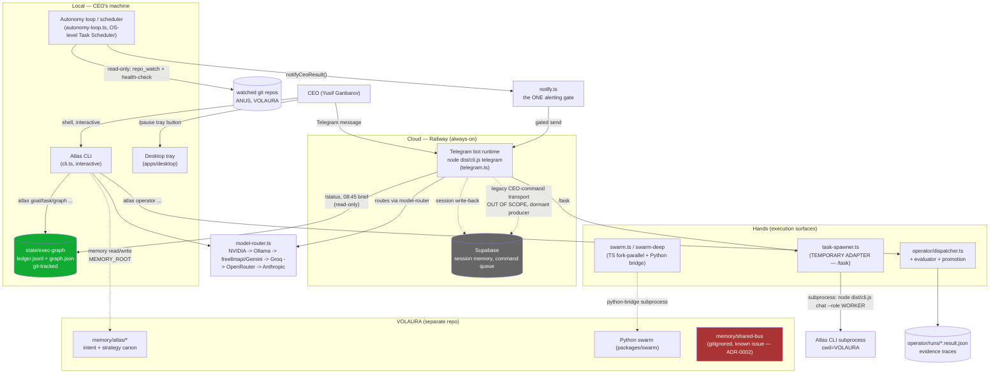

# Atlas / ANUS architecture map (EB-0)

Canonical system map as of EB-0 (branch `feat/arsenal-wiring`, HEAD
`ac6d384`). This is the entry point for "what talks to what" — component
docs and ADRs go deeper on any one piece; this file's job is to keep the
whole shape visible in one place and stay current.

**Status of this document:** the diagram and tables below describe code
that exists and is tested (IMPLEMENTED-LOCAL throughout unless marked
otherwise); they are not a claim that every path shown has been exercised
against the live Railway deployment. See the maturity labels in
`README.md` for per-component status.

## Context diagram

Legend: solid arrows are the primary, currently-live data paths; dotted
arrows are secondary/optional paths (VOLAURA memory access, Supabase
session mirroring, the dormant legacy queue). Green = the machine execution
authority (ADR-0001). Red = a known-issue node (ADR-0002).

## Component map

| Component | File(s) | Role |
|---|---|---|
| **Telegram bot runtime** | `src/telegram.ts` | The one deployed, always-on CEO interface. Command handlers, inbound-auth gate, `/status`, morning brief, voice transcription, `/task` spawner trigger. |
| **Atlas CLI** | `src/cli.ts` | Local interactive shell + every scriptable command (chat, swarm, exec-graph, operator, autonomy, health). |
| **Model router** | `src/model-router.ts` | Cost-ordered multi-provider routing (NVIDIA -> Ollama -> freellmapi/Gemini -> Groq -> OpenRouter -> Anthropic), role-based selection (FAST/WORKER/JUDGE/CRITICAL), runtime fallback. |
| **Notifier** | `src/atlas/notify.ts` | The one gate every proactive CEO-facing send passes through (ADR-0005). Silent by default; `briefing`/`error`/`important`/`remote-result` only. |
| **Policy** | `src/atlas/policy.ts` + `config/policy.yaml` | Declarative read-model over spend caps, pause, autonomy shell whitelist, fs-sensitive paths. Fail-closed on load failure. |
| **exec-graph** | `src/exec-graph/*` | The one machine execution authority for new Atlas-managed work (ADR-0001). Goal/task ledger, 11-state lifecycle, evidence-gated transitions. |
| **Operator contracts** | `src/operator/*` (`dispatcher.ts`, `contracts.ts`, `evaluator.ts`, `promotion.ts`, `lifecycle.ts`, `action-lane.ts`) | Task dispatch/evaluate/promote pipeline with its own evidence contract, distinct from exec-graph's task lifecycle. Reads `operator/tasks/*.json`, writes `operator/runs/*.result.json`. |
| **Task spawner** | `src/atlas/task-spawner.ts` | Telegram `/task` — spawns an Atlas CLI subprocess (cwd=VOLAURA) as a CEO-direct, ephemeral execution. TEMPORARY ADAPTER (ADR-0004 #2). |
| **Model swarm** | `src/swarm.ts`, `src/swarm-worker.ts`, `src/atlas/python-bridge.ts` | Fork-based parallel-agent decomposition (TS) or subprocess call into VOLAURA's Python swarm (13 perspectives, 4 DAG waves). |
| **Scheduler (OS-level)** | Windows Task Scheduler (external to this repo), invoking `atlas autonomy-tick --notify` | Not a Node daemon — an OS-level periodic trigger. See `docs/AUTONOMY-V0.md`. |
| **VOLAURA intent canon** | `C:\Projects\VOLAURA\memory\atlas` (separate repo) | Strategy/intent + cross-session memory canon (`ATLAS-CANON.md`). Not this repo's concern to modify directly. |
| **Supabase session memory** | `src/atlas/supabase-memory.ts` (tables `bot_sessions`, `bot_messages`, `bot_heartbeats`, `atlas_command_queue`) | Cloud-side session/heartbeat mirror with file-based local fallback; also hosts the legacy command-queue transport (ADR-0004 #1, currently dormant on the producer side). |

## AUTHORITY MAP

| Concern | Authority | Notes |
|---|---|---|
| Goals/tasks/execution state (new work) | `src/exec-graph` | ADR-0001. Evidence-gated, append-only ledger. |
| Decisions / intent / strategy | VOLAURA canon + CEO | ADR-0002. `ATLAS-CANON.md` remains the repo-split source of truth for where to edit. |
| CEO notifications (proactive) | `src/atlas/notify.ts` | ADR-0005. The only gate for unprompted sends. `/status`/brief are CEO-pulled or pre-existing scheduled reads, not a second authority. |
| Credentials / secrets | `.env` (local) / Railway env vars (cloud) — **names only**, never values in code, logs, or docs | See `SECURITY.md`, `docs/POLICY.md`. |
| Guardrail policy (caps, pause, shell whitelist) | `config/policy.yaml` via `src/atlas/policy.ts`, env-override-wins, fail-closed | `src/tools/shell.ts` / `src/tools/fs-guard.ts` remain the operative enforcement floor — policy.yaml documents, doesn't replace them. |
| Operator task dispatch/evaluation | `src/operator/*` | Separate lifecycle from exec-graph; classification #3 under ADR-0004 for its `tasks/*.json` inputs specifically. |
| Legacy CEO-command transport | Supabase `atlas_command_queue`, owner: cloud Telegram bot runtime / External CTO | ADR-0004 #1. Out of scope for this repo's exec-graph; zero code path between them. |

## Local / cloud boundary

- **Cloud (Railway):** exactly one process — `CMD ["node", "dist/cli.js",
  "telegram"]` (`Dockerfile`, built per `railway.json`'s `DOCKERFILE`
  builder), which `cli.ts`'s `telegram` command resolves by `import()`ing
  `telegram.js`. This is the only thing that runs unattended, always-on, on
  infrastructure the CEO doesn't have to keep a machine on for.
- **Local (CEO's machine):** the autonomy loop/scheduler (OS-level Windows
  Task Scheduler, not a cloud cron), the desktop tray, and **all
  `state/exec-graph` writes**. exec-graph has no cloud write path today —
  `atlas goal add` / `atlas task ...` / `atlas graph ...` are run locally,
  and the Railway image ships `state/` read-only (`src/exec-graph/README.md`).
  The cloud `/status`/brief can *read* exec-graph state that's baked into
  the deployed image at build time, but cannot write new tasks.
- **Why this split:** the cloud process must stay minimal, stateless-ish,
  and restart-safe (Railway's `ON_FAILURE` restart policy) — anything that
  needs durable, git-tracked, human-auditable state (exec-graph) or
  interactive control (the CLI, the tray) belongs on the machine a human is
  actually sitting at.

## Data / state flow (summary)

1. CEO sends a message (Telegram) or runs a command (local CLI).
2. Telegram path: inbound-auth gate (`isAuthorizedChat`) → command handler
   → model-router (for chat/skill/swarm requests) or a direct read (for
   `/status`).
3. CLI path: direct command dispatch, no network auth gate (local trust
   boundary is the machine itself).
4. Any exec-graph mutation (`goal add`/`task add`/`task move`/`task
   import`) appends one event to `state/exec-graph/ledger.jsonl` and
   rewrites `state/exec-graph/graph.json` as a derived cache (ADR-0003).
5. Evidence is never inlined as a blob — it's a typed reference
   (`commit`/`test-output`/`file`/`url`/`tool-receipt`/`other`) cited on
   the transition and the task (`docs/state-and-evidence-index.md`).
6. Any proactive CEO-facing message (not a reply to a command) passes
   through `notify.ts`'s gate before it can send (ADR-0005).
7. Cross-session memory (identity, journal, heartbeat) is file-based,
   rooted at `MEMORY_ROOT` (`src/atlas/path-util.ts`'s `getMemoryRoot()`),
   with an optional Supabase mirror when `SUPABASE_URL`/
   `SUPABASE_SERVICE_ROLE_KEY` are configured (`src/atlas/supabase-memory.ts`)
   — Supabase is a mirror here, not the source of truth; the file-based
   vault is. **`MEMORY_ROOT` differs by environment, not by default alone:**
   locally it defaults to `C:\Projects\VOLAURA` (the VOLAURA intent canon —
   see `ATLAS-CANON.md`), but the production `Dockerfile` explicitly sets
   `ENV MEMORY_ROOT=/app`, so the deployed cloud process reads/writes a
   container-local, Railway-volume-backed directory, **not** VOLAURA
   directly. Cloud Atlas does not read or write VOLAURA's memory files at
   all — only local CLI/autonomy processes do, by default.

## Trust boundaries + secrets policy

- **Inbound Telegram trust boundary:** every inbound message is checked
  against `TELEGRAM_CEO_CHAT_ID` (`isAuthorizedChat`, `telegram.ts`); an
  unset chat ID id fails closed — *all* inbound messages are refused
  (`[auth] FATAL: TELEGRAM_CEO_CHAT_ID unset — refusing ALL inbound
  messages`), not open by default.
- **Autonomous-actor trust boundary:** commands run by an unattended actor
  (`ATLAS_AGENT_ID=autonomy`, e.g. the `/task` subprocess) are restricted to
  a shell whitelist (`config/policy.yaml`'s `whitelist_autonomy`) on top of
  the existing BLOCKED/GATED denylist floor (`src/tools/shell.ts`) — CEO
  Telegram turns and the interactive CLI are not whitelist-gated, only
  denylist-gated.
- **Secrets:** environment variable **names** only appear in code, docs, and
  logs — never values. `.env`/`.env.*` and `*.pem`/`*.key`/`id_rsa` are
  denied paths for the fs tools regardless of actor
  (`src/tools/fs-guard.ts`, mirrored in `config/policy.yaml`'s `fs.sensitive`
  list). This document and every doc in `docs/adr/` and `docs/runbooks/`
  follows the same rule — no token values, chat IDs, or user-account
  absolute paths.
- **Filesystem trust boundary:** exec-graph rejects
  `__proto__`/`constructor`/`prototype` as goal/task ids at the persistence
  layer (`ledger.ts`'s `isSafeKey()`) — defense in depth against a
  malformed/malicious ledger line poisoning the in-memory snapshot via
  prototype pollution.

## EXCLUDED-BY-DESIGN

Explicitly not built, and why — so a future contributor doesn't reintroduce
these as "obviously missing":

- **No second router.** All model calls go through
  `src/model-router.ts`. A second, parallel routing path would defeat the
  cost-ordering/fallback guarantee and make spend auditing (`spend-tracker.ts`,
  `spend-policy.ts`) incomplete by construction.
- **No second Telegram authority.** Exactly one bot process, one inbound-auth
  gate, one `CEO_CHAT_ID` resolution point. A second bot or a second
  chat-ID-resolution path would reopen the exact "who can this send to"
  question ADR-0005 and the inbound-auth gate exist to close.
- **No VOLAURA execution state.** Per ADR-0002 — VOLAURA is intent/strategy
  canon, not a second task-lifecycle authority. Writing task-lifecycle data
  there would reintroduce the fragmentation ADR-0001 fixes.
- **No OpenClaw runtime in this repo.** Referenced in project-level notes
  as an orchestration tool under evaluation elsewhere in the ecosystem;
  ANUS does not embed it, spawn it, or depend on it.
- **No unbounded swarm.** Both swarm paths (`swarm.ts`'s TS fork-parallel
  and the Python bridge) run a bounded, explicit set of perspectives/waves
  — there is no self-spawning or recursive-swarm capability anywhere in
  this repo.
- **No cloud exec-graph writer.** Deliberate, not an oversight — see "Local
  / cloud boundary" above. Extending write access to the cloud process is a
  future ADR's decision, not an assumed next step.

## Links

- `docs/adr/0001-one-task-authority-exec-graph.md` through `0005-*.md`
- `docs/runbooks/exec-graph-recovery.md`,
  `atlas-pause-and-resume.md`, `morning-brief-and-status.md`,
  `legacy-task-cutover.md`
- `docs/state-and-evidence-index.md`
- `ATLAS-CANON.md` — the pre-existing repo-split canon
- `src/exec-graph/README.md`, `docs/QUEUE-CONTRACT.md`, `docs/POLICY.md`,
  `docs/PANIC.md`, `docs/AUTONOMY-V0.md`, `docs/DESKTOP-SHELL.md`
- `README.md` — component entry points + commands
