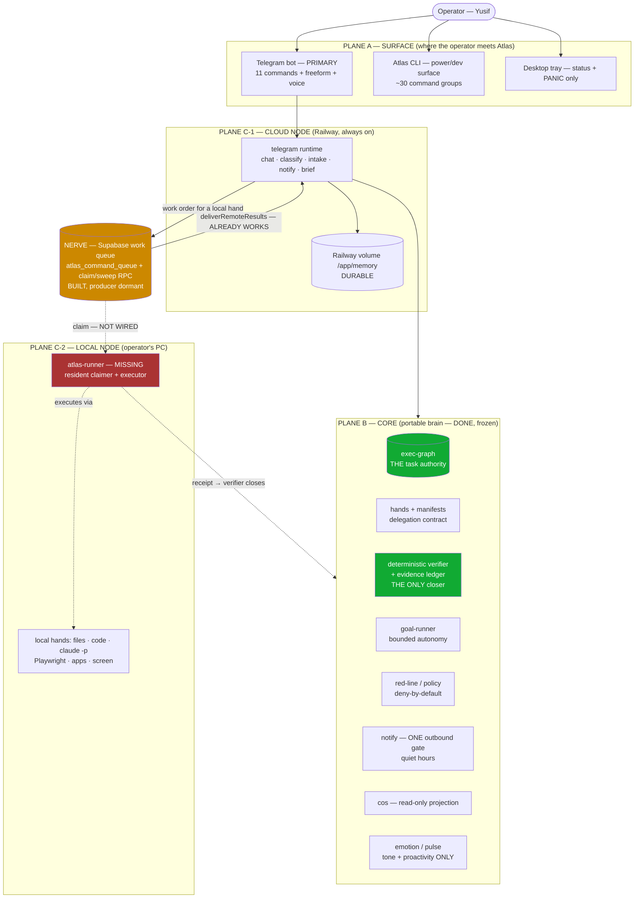

# ATLAS — ARCHITECTURE OF RECORD

> **Status:** authoritative · rewritten 2026-07-27 by the Fable seat at `main` @ `a7f81ee`, from four independent read-only recon sweeps (docs inventory, capability surface, state durability, cloud→local gap). Supersedes the "EB-0 + Mission 2 map" version of this file.
> **This file answers four questions and nothing else:** what Atlas IS, where each part RUNS, what is MISSING, and by what LAW the next thing gets built.
> **Doc law:** this is the ONLY architecture document. `docs/atlas-cto/ATLAS-MASTER-PLAN.md` is the ONLY forward plan. ADRs record decisions. `docs/atlas-cto/ATLAS-STATE-NOW.md` records current status. `VOLAURA/memory/atlas/codex-loop.md` is the journal. Anything else describing "how Atlas is built" is superseded (§0.1) and must not be treated as current. **Do not create a second architecture doc or a second plan — edit these two.**

---

## 0. Why this rewrite exists (the diagnosis)

A recon sweep on 2026-07-27 found **~180-190 documents (~2.7 MB) describing Atlas**, and *no single file* that answers "what is Atlas today." Six files each held partial current-state authority with no resolving hierarchy; the de-facto plan of record was a 340 KB append-only journal. The previous version of THIS file — which called itself "the canonical system map… stay current" — had **zero mentions** of `goal-runner`, `action-router`, `emotion`, `pulse`, `supervised-assist`, all of which had shipped.

The cost is not tidiness. It is that **every session begins with archaeology**, spends its budget on discovery, and pays for that discovery by writing another document — which raises the next session's archaeology cost. The orchestrator writing this file was itself four days stale on M4-M8 until it ran `git log`.

Second finding, larger: **the internals are excellent and the product is unreachable.** exec-graph, the Hand Contract, the deterministic verifier, red-lines, budgets, the evidence ledger — all real, all tested. And the operator's only real surface (Telegram) reaches **11 commands**, while `goal run`, `swarm-exec run`, `hand *`, `task *`, `graph *`, `cos brief`, `assist run`, `evidence audit` are **CLI-only, unreachable from his phone**. A freeform action message creates an exec-graph task and then **nothing executes it** — no daemon, in any runtime, watches for work.

Root cause, one line: **the project optimized for governance of building instead of delivery to the operator, and documentation grew as a substitute for a product surface.** This file is the correction.

### 0.1 Supersession list (these are NOT current; do not build from them)

| Document | Why superseded |
|---|---|
| `C:\Projects\ATLAS-SUPERASSISTANT-PLAN.md` | June plan; ADR-0009 explicitly supersedes its Jarvis-only framing. Historical. |
| `C:\Projects\ATLAS-IMPLEMENTATION-PLAN.md` | June plan; its gaps were implemented 2026-07-23 (see `docs/atlas-cto/MEGAPLAN-EXECUTION-2026-07-23.md`). Phase 4.1 superseded by `swarm-exec/intake.ts`. Historical. |
| `C:\Projects\ATLAS_BASELINE.md` | Phase-0 snapshot; ADR-0009 demotes "Jarvis-shell" to a phase, not the destination. Historical. |
| `ARCHITECTURE-DECISION.md` (repo root) | Frozen at "2 of 7 decisions implemented" (April/May). Contradicts the shipped M1-M8 ledger. Historical. |
| `ATLAS-CANON.md` (repo root) | Repo-split layout only; folded into §3 and §8 here. Keep for the ANUS↔VOLAURA split rule; it is not an architecture. |
| `VOLAURA/memory/atlas/CANONICAL-MAP.md` | Self-flagged stale since 2026-05-03. |
| `C:\Projects\ATLAS\` | Archive since 2026-06-27 (ADR-0009 decision 9). Never develop there. |

---

## 1. What Atlas is (from the operator's seat, not the code's)

**Atlas is one agent with one operator.** For Yusif Ganbarov it must: talk to him where he already is (Telegram), do work on his machines, remember him and his people, report before he has to ask, and never take an irreversible action without his explicit word. Products (VOLAURA, OPSBOARD, MindShift) are its **customers**, not its identity (ADR-0009).

Three things follow, and they are binding:

1. **A capability that the operator cannot reach does not exist.** Internal quality is necessary and not sufficient.
2. **Atlas spans machines by nature.** Its mouth lives in the cloud (always on); its hands must live where the work is (his PC). Any design that ignores this produces a talking head or an unreachable tool — both have already happened.
3. **Trust is the product.** The deterministic verifier, the red-line gate and the evidence ledger are not overhead; they are why an agent is allowed near a real machine at all.

---

## 2. Delivery ladder (acceptance in the operator's words, not in tests)

Every mission must move exactly one level, and its DoD must include that level's sentence.

| Level | The operator can… | Status (2026-07-27) | Blocker |
|---|---|---|---|
| **L0 Talks** | "I text the bot, it answers as Atlas." | ✅ DONE — live, `@volaurabot`, single poller | — |
| **L1 Sees** | "I ask from my phone what's in flight / what's waiting on me, and get the truth." | ⚠️ HALF — `cos brief`/`drift` and exec-graph reads exist, **not wired to Telegram** | Wire `cos`+`graph` to bot commands |
| **L2 Hands** | "I text 'do X', it happens on my machine, the result comes back to Telegram." | ✅ **BUILT + LIVE** (2026-07-27) — runner autostarts via Task Scheduler, verified live; end-to-end round-trip from the operator's own phone still untested by him | safety envelope — see MASTER-PLAN P0 |
| **L3 Remembers** | "It doesn't forget after a restart." | ⚠️ PARTIAL — memory/mood/journal durable; task graph, budgets, evidence, control-state **die on redeploy** | State-root law — §8 |
| **L4 Speaks/hears** | "I send a voice note and get a voice answer." | ❌ NOT BUILT — STT/TTS absent (`voice` handler exists, transcription path disabled) | VOICE-01 |
| **L5 Initiates** | "It messages me first when something matters, and shuts up at night." | ⚠️ MOSTLY — notify chokepoint + quiet hours + morning brief shipped; content still thin | Feed brief from `cos` |

**Current true position: L0 done, L1 half, L2 blocked, L3 partial.** L2 is the unlock the operator has asked for repeatedly; everything else is secondary until it lands.

---

## 3. Topology — three planes, two runtimes, one nerve

Green = authority. Orange = built but unfed. **Red = does not exist and is the reason L2 is blocked.**

---

## 4. PLANE A — Surface, and the reachability law

**LAW A1 — Telegram-first.** Every operator-meaningful capability MUST be reachable from Telegram, or carry an explicit `CLI-ONLY (reason)` line in the table below. Silence is a violation.

**LAW A2 — one bot, one auth gate.** Exactly one Telegram process, one `TELEGRAM_CEO_CHAT_ID` resolution, fail-closed on unset. A second poller causes `409 Conflict` and silent message loss (observed 2026-07-23).

**LAW A3 — the tray stays thin.** Status + local PANIC only. It is not a second brain.

Current reachability (receipts: `src/telegram.ts` command registrations, `src/cli.ts` command groups):

| Capability | Telegram | CLI | Verdict |
|---|---|---|---|
| Chat / ask | ✅ freeform | ✅ `chat` | ok |
| Pause / resume | ✅ `/pause` `/resume` | ✅ `control` | ok |
| Status / spend | ✅ `/status` | ✅ `status` | ok |
| Freeform action → task | ✅ (action-router) | ✅ `swarm-exec intake\|commit` | **created but never executed** — §6 |
| Task graph read/write | ❌ | ✅ `task` `graph` `goal add` | **VIOLATION → L1** |
| Chief-of-Staff brief / drift | ❌ | ✅ `cos brief\|drift` | **VIOLATION → L1** |
| Goal-runner autonomous run | ❌ | ✅ `goal run` | **VIOLATION → L2** |
| Execute a committed task | ❌ | ✅ `swarm-exec run` | **VIOLATION → L2 (the dead end)** |
| Hand assign / submit / verify | ❌ | ✅ `hand *` | CLI-ONLY (operator-grade primitive) — acceptable |
| Evidence audit | ❌ | ✅ `evidence audit` | CLI-ONLY (audit tool) — acceptable |
| Supervised form assist | ❌ | ✅ `assist run` | CLI-ONLY (**hard TTY gate by design** — a human must be at the console) |
| Screen capture | ❌ | ✅ `capture` | CLI-ONLY (local display) — should become runner-mediated at L2 |
| Voice in/out | ❌ | ❌ | not built — L4 |

---

## 5. PLANE B — Core (the brain). DONE. Freeze it.

This plane is the project's real asset and needs no redesign. Its invariants are binding on every future module:

| Invariant | Meaning | Enforced by |
|---|---|---|
| **I1 — one task authority** | `exec-graph` is the only place task state lives, per node. Append-only ledger + derived snapshot. | ADR-0001/0003 |
| **I2 — only the verifier closes** | Nothing self-declares success. `verified`/`rejected` reachable ONLY through the deterministic no-LLM verifier path. | ADR-0006, `verifier-port.ts` (structural, not a flag) |
| **I3 — evidence or it didn't happen** | Every closure cites falsifiable evidence; receipts are secret-scanned *before* the append. | ADR-0003/0006, `src/evidence/*` (M8) |
| **I4 — irreversible needs a human** | Money, deletion, prod-DB, outbound send/post, submit, credentials, deploy: deny-by-default, human gate. | `goal-runner/red-line.ts`, policy |
| **I5 — one outbound gate** | All proactive messages pass `notify.ts`; quiet hours 23:00-08:00 Baku; panic bypasses. | ADR-0005, M7 |
| **I6 — bounded autonomy** | Wall-clock, attempts, decomposition rounds, circuit breaker by fingerprint, single active lease. | `goal-runner/budgets.ts` |
| **I7 — mood never touches truth** | Emotion/pulse may color tone and timing only; never facts, verification, money or legal. | `emotion.ts`, `pulse.ts`, `emotional-safety.ts` |
| **I8 — cost order** | Free/credit providers first; a frontier model is never a swarm worker. | `model-router.ts` (anthropic has no WORKER role), ADR-0007/013 |

**Freeze rule:** Plane B changes only to close a proven defect or to serve a ladder level. It does not grow features on its own momentum.

---

## 6. PLANE C — Execution. The missing plane.

### 6.1 Cloud node (Railway) — what it can and cannot do

Runs exactly one process: `node dist/cli.js telegram` (`Dockerfile` CMD). It **can**: chat, classify intent, intake tasks, notify, brief, read state, call free LLMs. It **cannot, ever**: touch the operator's filesystem, drive a browser with his sessions, open his apps, run his IDEs or `claude` on his machine. That is a property of physics, not a bug — a container in another country is not his PC.

Known cloud-specific defects (receipts): `task-spawner.ts` hardcodes `cwd: 'C:/Projects/VOLAURA'` → `/task` is broken-by-construction in the container; the `openmanus` action-lane route defaults to `C:/Projects/OpenManus` → fails there too. Both are symptoms of code written for one runtime and deployed to the other — exactly what §6.3's law prevents.

### 6.2 Local node (operator's PC) — `atlas-runner` — **BUILT AND LIVE (2026-07-27)**

Shipped as `src/atlas/atlas-runner.ts` + CLI `atlas runner status|peek|tick|start`, installed as a Windows Task Scheduler logon task (verified live: task `Ready`, process running, heartbeat fresh). Three real defects were found and fixed by running it against live infrastructure rather than by unit tests alone (repo-root resolution when bundled; a crash path on malformed input; an empty-queue result being mistaken for a claimed row).

**Its safety envelope is NOT yet at the standard the rest of the system holds** — see `docs/atlas-cto/ATLAS-MASTER-PLAN.md` phase P0 (work-order authenticity, red-line coverage in Russian, actor-scoped writes, restart-durable spend cap) and P4 (the sandbox decision this design still owes). Treat P0 as a prerequisite for widening what the runner is allowed to do.

The contract below remains the design of record.

**Contract for `atlas-runner`:**
- A resident process on the operator's Windows machine (Task Scheduler at logon, or the tray extended to host it). Survives reboot; announces liveness via heartbeat.
- **Claims** work orders addressed to local hands from the nerve (§7), one at a time, honoring `claim`/lease semantics.
- **Mirrors** each claimed order into its OWN local `exec-graph` — so I1/I2 hold on the executing node, and the operator has a local audit trail.
- **Executes** through existing hands only: `local-readonly`, shell allowlist, Playwright browser, `claude -p` executor sessions, screen capture. No new execution primitive.
- **Submits a receipt** to the local verifier; the verifier — not the runner — closes the task.
- **Writes the result back** to the nerve; the cloud's already-working `deliverRemoteResults` posts it to Telegram.
- **Refuses** anything red-line (I4) and anything not on its hand's allowlist; refusals return a `needs-approval` result, never a silent drop.
- Honors control state: `pause`/PANIC stops claiming immediately.

**What must NOT be built:** a second task authority, a second notifier, a bot instance on the PC (causes `409`), or an unattended path to irreversible actions.

### 6.3 Runtime law

**LAW C1 — every capability declares its runtime.** `cloud` | `local` | `either`. A capability whose requirements (TTY, display, Windows path, local FS, browser profile) contradict its declared runtime is a defect, not a limitation.
**LAW C2 — no cross-runtime hardcoded paths.** Anything referencing `C:\...` may run only on `local`.
**LAW C3 — the operator's machine is not assumed on.** Cloud-side flows must degrade honestly ("твой раннер офлайн, задача ждёт") rather than hang.

---

## 7. The nerve — how the two nodes share work

`exec-graph` is file-local by design; it cannot be the cross-machine channel. The transport already exists and is unused:

**DECISION (2026-07-27): Supabase `atlas_command_queue` is the work transport; `exec-graph` remains the authority on each node.**

- Cloud: intent → `action-router` → exec-graph task (governance) → **if the task's hand is local-only, enqueue a work order** (`queueRemoteCommand`, currently dormant by a deliberate 2026-07-10 board decision — this decision re-enables it under governance).
- Local: `atlas-runner` claims (`claim_next_command` RPC exists), mirrors, executes, verifies, completes (`completeCommand`/`failCommand` exist).
- Cloud: `deliverRemoteResults` (already polls every 120 s and works) posts the outcome to Telegram.
- Stale orders are swept (`sweep_stale_commands` RPC exists).

Why this and not something new: it is durable, already provisioned, RLS-gated, audit-friendly, and requires **no new protocol** — only a producer, a consumer and a governance wrapper. `docs/QUEUE-CONTRACT.md` must be updated from "producer-dormant" to this decision when the work lands.

**Nerve laws:** the queue carries *work orders and results*, never task-lifecycle authority (I1); every order carries the exact action payload for the operator's approval card (Lies-in-the-Loop defense: render exact JSON, log SHA-256, never a summary); nothing irreversible may traverse it without a prior human `yes`.

---

## 8. State & durability law

**LAW S1 — one state root per node.** All runtime state resolves under a single root: `ATLAS_STATE_ROOT`. Cloud → `/app/memory/atlas/state` (the mounted Railway volume is the ONLY durable path there). Local → `%USERPROFILE%\.atlas\state`. No store may resolve to `process.cwd()` or `os.homedir()` without an override.

**LAW S2 — durability is a property of the store, declared here.** A store that dies on restart must say so in this table, or it is a defect.

Current reality (recon 2026-07-27) — cloud durability is the problem:

| Store | Cloud durable? | Why |
|---|---|---|
| memory/journal/heartbeat/MOOD/conversations | ✅ | resolve via `MEMORY_ROOT=/app` → `/app/memory` (volume) |
| Supabase (`bot_sessions`, `bot_messages`, `atlas_learnings`, `llm_spend`) | ✅ | external DB |
| **exec-graph ledger + snapshot** | ❌ | `/app/state/…` — **the whole task authority resets on redeploy** |
| **operator/control-plane state** (pause/stop) | ❌ | hardcoded `cwd/operator/state/…`, **no env override exists** |
| goal-runner budgets + lease | ❌ | `ATLAS_GOAL_BUDGET_DIR` unset → circuit breaker resets |
| evidence ledger (M8) | ❌ | `ATLAS_EVIDENCE_DIR` unset |
| notify queue, emotion audit, spend receipts, provider health, instance lease, breadcrumb | ❌ | default to `~/.atlas` / cwd, all unset |
| swarm-exec run bundles, intake drafts | ❌ | **no env override exists in code at all** |

**Fix order (config first, then code):** set the ten `ATLAS_*` env vars under `/app/memory/atlas/state` in Railway; then add `ATLAS_SWARM_EXEC_DIR`, `ATLAS_INTAKE_DIR`, `ATLAS_OPERATOR_STATE_PATH` overrides in code following `exec-graph/ledger.ts`'s resolver pattern; then collapse all of them behind `ATLAS_STATE_ROOT` (S1).

---

## 9. Data plane truth

Code depends on: `bot_sessions`, `bot_messages`, `bot_heartbeats`, `atlas_command_queue` (+ `claim_next_command`, `sweep_stale_commands`), `atlas_learnings` (+ `recall_atlas_memories`, `bump_recall_count`), `llm_spend`.

**Drift:** migrations exist in `db/` for `llm_spend` and `atlas_learnings` (with `decay_multiplier` in the base table). **No migration exists for `bot_sessions`, `bot_messages`, `bot_heartbeats`, `atlas_command_queue` or their RPCs** — hand-created in prod, unversioned. That is a restore-from-zero hazard: a fresh Supabase project cannot be provisioned from this repo.

**LAW D1 — no unversioned prod schema.** Every table/RPC the code touches has a migration in `db/`. Applying to live remains an operator gate.

---

## 10. Build law — how work happens from now on

1. **Ladder-anchored.** Every mission names its level (L0-L5) and its DoD includes that level's operator sentence. "Tests green" is necessary, never sufficient.
2. **Surface + runtime declared.** Every capability states where it is invoked from and where it runs (LAW A1, C1).
3. **No new authority.** exec-graph closes nothing but through the verifier (I1/I2). No second router, no second notifier, no second delegation store.
4. **No new persistence idiom.** Append-only ledger + derived snapshot, under `ATLAS_STATE_ROOT` (S1).
5. **No new architecture document.** This file is edited; ADRs record decisions; STATE-NOW records status; the journal records events. A new "plan" doc is a smell — the answer is a mission, not a document.
6. **Irreversible stays human-gated forever** (I4). Autonomy widens only on accumulated verified history, never by convenience.
7. **Delete-or-mark on supersede.** Superseding a design means editing §0.1 in the same commit.

---

## 11. Reality map (2026-07-27, `main` @ `a7f81ee`)

| Module | Plane | Runtime | Reachable from | Status |
|---|---|---|---|---|
| `telegram.ts` | A | cloud | operator | live (11 commands + freeform + emotion + action-router) |
| `cli.ts` | A | local/either | operator (shell) | live, ~30 groups — carries most capability |
| `apps/desktop` tray | A | local | operator | live, thin (status + PANIC) |
| `exec-graph` | B | either | CLI | live, authority, **ephemeral in cloud** |
| `hands` + manifests (M5) | B | either | CLI | live |
| verifier + `evidence` (M8) | B | either | CLI | live |
| `goal-runner` | B | local (in practice) | CLI only | live, unreachable from phone |
| `swarm-exec` | B | either | CLI + intake from phone | live; **run step unreachable from phone** |
| `cos` | B | either | CLI only | live, unreachable from phone (L1 gap) |
| `notify` + queue (M7) | B | cloud | internal | live, quiet hours |
| `emotion` / `pulse` / `emotional-safety` | B | cloud | internal | live, tone-only |
| `model-router` (M6 health) | B | either | internal | live, free-first, anthropic no-WORKER |
| `action-router` | A→B | cloud | freeform text | live → **dead-ends at task creation** |
| `atlas_command_queue` transport | nerve | both | — | **built, producer dormant** |
| `atlas-runner` | C-2 | local | — | **DOES NOT EXIST — L2 blocker** |
| `operator/*` (legacy dispatcher) | C | local | hidden text triggers | legacy; superseded by hands/exec-graph; cloud paths broken |
| `task-spawner` (`/task`) | C | local only | Telegram | **broken in cloud (hardcoded Windows cwd)** |

---

## 12. Gap register (ranked; each maps to a ladder level)

1. ~~No local runner~~ → **CLOSED 2026-07-27**, runner built + autostarted (§6.2). Replaced by: **the runner's safety envelope is below the standard the rest of the system holds** — unsigned work orders, Russian-language coverage gaps in the red-line list, actor-blind file writes, restart-resettable spend cap, and no execution sandbox. See MASTER-PLAN P0 + P4. This is now the top risk in the system.
2. ~~Action-router dead end~~ → **CLOSED 2026-07-27**, wired through the Supabase nerve to the runner (§7).
2b. **Not rebuildable / not backed up** → several live tables have no migration in the repo, and no backup or restore mechanism exists anywhere. See MASTER-PLAN P1. (Raised by the 2026-07-27 audit.)
3. **Cloud state ephemeral** → task graph, budgets, control state, evidence reset on every redeploy. (§8)
4. **L1 not wired** → the operator cannot see his own board from his phone. Cheapest real win. (§4)
5. **Unversioned prod schema** → cannot rebuild the DB from the repo. (§9)
6. **Voice absent** → L4. (§2)
7. **Legacy duplicates** (`operator/*`, `task-spawner`) → two lifecycles, one broken in cloud; retire behind hands/exec-graph.
8. **Doc sediment** → §0.1 executed in this commit; keep it executed.

---

## 13. Excluded by design

No second model router. No second Telegram authority or bot instance. No second delegation store. No unbounded/self-spawning swarm. No VOLAURA execution state (VOLAURA = intent/lived memory only). No autonomous real-portal submit — submit is a human key, permanently. No frontier model as a swarm worker. No mood-gated refusal to work.

## 14. Links

ADR-0001 (task authority) · 0003 (ledger) · 0005 (notify) · 0006 (hand contract) · 0007 (swarm-exec + honest verification) · 0008 (cos) · 0009 (vision: portable agent-factory) · `docs/atlas-cto/ATLAS-OPERATING-CANON.md` (portable behavior gates) · `docs/atlas-cto/ATLAS-STATE-NOW.md` (status) · `docs/QUEUE-CONTRACT.md` (nerve; update on L2) · `docs/runbooks/*` · `src/{exec-graph,hands,cos}/README.md`
