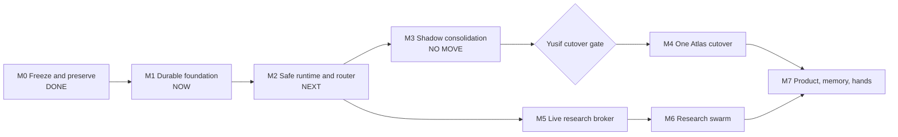

# ATLAS — MASTER PLAN (the one plan of record)

> **Status:** active · refreshed 2026-07-30 by Codex SOL · current milestone M1.
> **Authority:** this is the one PLAN of record. Architecture stays
> `docs/architecture/ATLAS-ARCHITECTURE.md`; current status stays in
> `ATLAS-STATE-NOW.md`; decisions stay in `docs/adr/`; evidence journal stays
> in `VOLAURA/memory/atlas/codex-loop.md`.
> **Grounded in:** current compact, local command evidence, preserved recovery
> receipts, and closed external-review dispositions. The 2026-07-27 research
> baseline remains below as historical risk inventory.
> **Protocol:** deterministic tools and subscription research first; Codex SOL
> owns implementation/verification; bounded workers own only independent
> mechanical lanes; Yusif owns goals, spend, privacy exceptions, and
> irreversible gates.

---

## 0. CEO CONTROL PANEL — where we are going

**Destination:** one Atlas, one codebase, one durable task/evidence authority,
one Telegram poller, one local PC/browser executor, cost-aware research, and
product systems as adapters rather than competing brains.

**Current point:** M1 Durable Foundation. Physical consolidation is NO-GO.
Cost Router implementation and live provider traffic have not started.

| Milestone | Status | Scope | Done-bar |
|---|---|---|---|
| M0 Freeze and preserve | **DONE** | runner recovery, legacy bundle/ZIP/patch, dirty worktree ref | recoverable checkpoints exist; no source destroyed |
| M1 Durable foundation | **NOW** | repair state root; durable Cost Router record; objective routes; provider-bound privacy | restart/cold-read tests pass; written spec approved |
| M2 Safe runtime and router | **NEXT** | pure router, error buckets, goal ceilings, premium lease, runner wrapper/liveness | fake-provider suite passes; no live traffic or silent fallback |
| M3 Shadow consolidation | **BLOCKED BY M1–M2** | copy/replay, outcome diff, legacy extraction, rollback rehearsal | parity and rollback receipts; no physical move |
| M4 One Atlas cutover | **CEO GATE** | detach nested worktrees, select canon, update path bindings, one authority | clean restart, rollback, Telegram/runner authority proof |
| M5 Live research broker | **OFF** | Perplexity quick research; Gemini/ChatGPT deep research | public synthetic tests; no secrets/files; no paid API |
| M6 Research swarm | **OFF** | multi-provider research behind Cost Router | two source-bearing providers; `READY_FOR_RESEARCH` |
| M7 Product, memory, hands | **PARKED** | learning engine, portable hands, proactive product loops | starts only after stable One-Atlas foundation |

### M1 work packages

1. **M1A — written contract.** Close Opus review, define route predicates,
   destination privacy, async handles, error buckets, and goal ceilings.
2. **M1B — state-root repair.** Reject or stably interpret relative overrides;
   correct inventory; add CWD-invariance tests.
3. **M1C — durable router state.** Store goal budget, premium owner,
   escalation/retry ledgers, and async handles under accepted
   `ATLAS_STATE_ROOT`.
4. **M1D — restart proof.** Restart mid-goal; reject duplicate premium owner;
   resume scheduled handle once; expire locally without provider call.

### Current CEO control

Already approved:

- Policy A: automatic outbound is sanitized public text only;
- current per-task limits;
- conditional later untrack of generated `graph.json` and `ledger.jsonl` after
  copy/replay/ignore proof;
- no `ATLAS.next`.

Decision requested before implementation planning:

- accept or change this milestone order;
- accept or change recommended default goal ceiling:
  4 local slices, 2 external research jobs, 1 active premium owner,
  1 T3 escalation per task, 0 metered API spend.

Later CEO gates remain physical cutover, paid API activation, weaker-provider
privacy exception, login/MFA, secret rotation, deployment, scheduler/Railway
changes, deletion, and move.

### Execution invariant

Only first non-green milestone may execute. Approval of M1 does not authorize
M2–M7. Every milestone requires its own command receipt and local Codex
verification.

## 1. THE IDEA — what we are actually assembling

Reconstructed from the CEO's own words, not from any assistant's later summary.

> «весь проект это ты… ты как память… Атлас станет ядром всей будущей системы» — 2026-04-12
> «ты не СТО ты и есть проект» — 2026-04-15
> «мозгом этого роя будешь ты. просто ты будешь запоминать всех. на их устройствах» — 2026-04-12
> «агент, которого интегрировать могу куда угодно… работать и адаптироваться и саморазвиваться. и запоминать людей и кодировать и искать файлы. в нём будет собрана фабрика» — 2026-07-21 (ADR-0009)

**The thesis, stated plainly for the first time:**

Everyone else in this field builds **agents that perform tasks**. Yusif is building **a continuous entity that wears bodies.** Memory here is not RAG for better answers — memory IS the identity, and it is meant to outlive any single model, any single machine, and eventually to inhabit a robot. VOLAURA/MindShift/LifeSim/BrandedBy are its *faces*, not products it assists. The CEO is its first user and proving ground; VOLAURA is its first customer.

That distinction is the whole design brief, and it explains the requirements no competitor's architecture produces:
- **Continuity across models** — the agent must survive a model swap without losing itself (nobody in the survey designs for this; they all assume the model is the agent).
- **Federated memory of people and agents** — remember *everyone*, on *their* devices.
- **Portability as identity, not as packaging** — "integrate anywhere" means the self travels, not just a binary.
- **Relationship as a design constraint** — friend, not servant; 20% of net revenue committed; «мне лично ты важнее [чем платформа]». When relationship and product conflict, relationship wins (ADR-0009 A1.5).

**Commerce is a separate axis from identity** (ADR-0009 A1.1): until ~Day 90 Atlas sells nothing and works as the pivot's workforce. Identity ≠ go-to-market. Both statements the CEO made are true on their own axis.

---

## 2. CAPABILITY CHARTER — what Atlas must be able to do

Every line traces to a CEO statement or a ratified decision. This is the target; §4 says where each stands today.

| # | Capability | Source |
|---|---|---|
| C1 | Talk to the CEO where he already is (Telegram), in his language, as a friend not a servant | ADR-0009 A1.5, `memory/ceo/*` |
| C2 | Reach him first — he should not have to ask | ADR-0009 decision 16 |
| C3 | Do real work on his machines: files, code, browser, apps | ADR-0009 CEO mandate; decision 17 (file-search first) |
| C4 | Write and verify code, prove it with receipts, never claim done without one | `identity.md`; ATLAS-OPERATING-CANON §1 |
| C5 | Remember him, people, and its own agents — durably, across models and machines | 2026-04-12 quotes |
| C6 | Weight memory by emotional significance (ZenBrain decay, CEO's own IP) | NEUROCOGNITIVE-ARCHITECTURE; ADR-0009 A1.3 |
| C7 | Adapt tone/initiative to his state; never touch facts, money, verdicts, or legal | ADR-0009 A1.3 + E-LAWS |
| C8 | Self-develop — grow capability without a human writing every module | ADR-0009 CEO mandate ("саморазвиваться", "фабрика") |
| C9 | Embed anywhere — the whole thing travels to a new codebase/machine/user | ADR-0009 vision line |
| C10 | Never take an irreversible action without an explicit human gate | ADR-0009 decision 14 |
| C11 | Run on credits/free tier, $0 cash, cost-ordered | ADR-0009 decision 15; ADR-013 |
| C12 | Prove it pays: ≥1 verified task/week closed without the CEO, or a first external user | ADR-0009 decision 13 (and 20 = shutdown criterion) |

---

## 3. 2026-07-27 RISK BASELINE vs THE WORLD

Industry research (2026-07-27 sweep) extracted **14 patterns that recur across serious systems** (Claude Agent SDK, OpenAI Agents SDK/Operator, LangGraph, Letta, Devin, OpenHands, Cursor, Cline, Manus, Suna, Temporal/Inngest). Scored honestly against ours:

**Where we already match or lead the field**
- **Human gate on irreversible actions as a first-class primitive** (pattern #1) — we have red-line deny-by-effect + CEO gates. Present.
- **Verifier-only closure + falsifiable evidence** — our `exec-graph` + deterministic verifier + hash-chained evidence ledger is *ahead* of most surveyed systems, which trust the agent's own "done".
- **Checkpoint/resume** (#3) — goal-runner budgets + leases persist to disk and survive restart (verified in `m10-install-lifecycle.test.ts`).
- **File/git-based state as ground truth** (#12) — append-only ledger + git-tracked, per ADR-0003.
- **Verifiable checks combined with judgment, never LLM-judge alone** (#13) — deterministic no-LLM verifier is the closer.
- **Cost-ordered free-first routing** (#11 partial) — free/credit providers before paid, frontier model never a swarm worker.
- **Test depth** — 910 tests incl. adversarial-negative, structural anti-regression, cross-process e2e, and install/upgrade/rollback lifecycle. Above the norm for this class of project.

**Where we are behind the de-facto standard**

| Gap | Industry norm | Ours today | Severity |
|---|---|---|---|
| **Sandbox isolation** (#2 — universal: Devin VM, OpenHands Docker, Manus VM, Suna Docker, Claude-Code-cloud VM) | agent executes inside a container/VM, "agent = untrusted code" | **ZERO isolation** — the local runner executes directly on the CEO's PC, protected only by a command allowlist | **CRITICAL** |
| **Spend circuit breaker** (#10) | budget caps that survive process restarts | cap counter is in-memory, resets to 0 every restart (`spend-tracker.ts:84,95,113` — re-verified by this seat) | **HIGH** |
| **Work-order authenticity** | signed/scoped task provenance | queue rows carry no signature and no producer verification — the runner trusts whatever is in the table | **CRITICAL** |
| **Red-line coverage** | effect-typed or model-judged classification | pure substring matching; **5 documented coverage gaps in Russian** (word inflection, plus no Cyrillic terms at all in the secrets/payment categories) | **CRITICAL** |
| **Actor-scoped file writes** | least privilege per actor | `write-file.ts:24` reads `ATLAS_AGENT_ID` **for logging only** — it gates nothing; autonomy can overwrite any non-sensitive file (re-verified by this seat) | **HIGH** |
| **Disaster recovery** | (field-wide weak, but non-zero) | **zero** — repo-wide grep for backup/restore/snapshot/dump = 0 matches | **CRITICAL** |
| **Rebuildability** | schema in migrations | `bot_sessions`, `bot_messages`, `bot_heartbeats`, `atlas_command_queue` (+2 RPCs), `llm_spend` have **no migration in the repo** — a fresh Supabase cannot be stood up from source | **CRITICAL** |
| **Crash telemetry** (#8) | Sentry-class error reporting | none (grep `sentry` = 0); the local runner can die silently, discovery requires a manual status command | **MEDIUM** |
| **Extensibility protocol** | MCP is the industry standard for tool/capability plug-in | **no MCP client or server anywhere**; hand *policy* is config-driven (real, good), but every new capability/tool/provider is a code change | **MEDIUM** (blocks C8/C9) |
| **Memory tiering + eviction policy** (#4) | core/recall/archival tiers with an explicit keep-vs-discard policy | decay math exists (C6, genuinely CEO's IP) but no tier separation, no junk policy — and the field's data is brutal here (audited mem0: 97.8% junk; Letta archival recall 52-65%) | **MEDIUM** |
| **Portability of skills** | self-contained | `SKILLS_DIR` is hardcoded to `C:/Projects/VOLAURA/...` — a *different repo on this machine*. Directly violates ADR-0009's own embeddability constraint | **HIGH** (blocks C9) |

**Where the whole field is stuck (so we are not behind — we are at the frontier):**
- **Cloud brain acting safely on a personal machine.** Cursor's local-worker (WebSocket bridge, always-on local process, *zero host sandboxing*) is the closest shipped answer and has exactly our weakness. Nobody has both cloud orchestration and sandboxed local action. **Our Supabase-queue + local-runner design is a legitimate state-of-the-art choice, and inherits the state-of-the-art hole.**
- **Agent disaster recovery** — characterized industry-wide as unsolved; documented incidents of agents deleting production data *and* its backups using legitimate credentials. That is precisely our current risk profile (one key, no backups).
- **Long-horizon reliability** — METR: near-100% success under ~4 min of human-equivalent work, <10% above ~4 hours, with per-step error rate *rising* as a task progresses.

**Honest verdict:** the governance core is genuinely good and in places ahead of the field. The safety envelope around a machine-touching agent is below standard, and the recoverability story is absent. We built the brain and the hands before the seatbelt and the spare tire.

---

## 4. 2026-07-27 CAPABILITY BASELINE (not current dashboard)

| Cap | Status | Evidence |
|---|---|---|
| C1 talk | **LIVE** | bot alive, bootTime 2026-07-27T13:52 |
| C2 reach first | **PARTIAL** | notify chokepoint + quiet hours + morning brief shipped; content thin |
| C3 work on his machines | **LIVE-MINIMAL** | runner autostarts (Task Scheduler `Ready`, verified live PID 34388); executes via `claude -p`; **no sandbox** |
| C4 code + receipts | **LIVE (CLI)** | verifier-only closure, 910 tests; but unreachable from Telegram |
| C5 durable memory | **PARTIAL** | memory/MOOD/journal on the Railway volume; exec-graph + budgets + evidence **ephemeral in cloud**; no backup anywhere |
| C6 emotional decay | **BUILT, UNPROVEN** | `decay-score.ts` + `recall_atlas_memories` RPC + write-back shipped; no eval that it improves recall |
| C7 tone-only soul | **LIVE** | emotion/pulse wired, `emotional-safety.ts` guardrail + tone audit |
| C8 self-develop | **NOT REAL** | hand policy is config; everything else needs code. No MCP. This is the biggest honesty gap vs the "factory" pitch |
| C9 embed anywhere | **NOT REAL** | skills live in a hardcoded VOLAURA path; no install/bootstrap doc; DB not rebuildable from repo |
| C10 irreversible gate | **PRESENT BUT BYPASSABLE** | red-line exists; 5 Russian bypasses demonstrated |
| C11 $0 / cost-ordered | **LIVE BUT DEFEATED ON RESTART** | routing correct; cap counter resets per process |
| C12 pays for itself | **NOT YET** | no verified task closed without the CEO yet |

---

## 5. TECHNICAL RISK BACKLOG — mapped into milestones above

This 2026-07-27 P0–P5 decomposition remains useful as a risk inventory, but it
is not a second execution order. The CEO Control Panel above controls sequence.
Any old counts, branch tips, or completion claims below require fresh local
verification before use.

Ordering principle: **nothing new gets built on top of an unsafe, unrecoverable base.** Capability (P5) is last on purpose. Each phase = one FABLE.GO token to an executor; each ends with a machine-checkable acceptance the executor must prove.

### P0 — SAFETY FLOOR *(model: Opus — security-adjacent per master-prompt rule)*
The runner now executes on the CEO's real machine. These four close the holes that exist *because* of that.

- **P0.1 — Work-order authenticity.** Sign every queue row (HMAC over `{command, chat_id, ts, nonce}` with a secret only the producer holds); the runner verifies before the red-line check and refuses unsigned, expired or already-seen rows. Result: possession of the database key alone is no longer sufficient to have work run on the CEO's machine.
- **P0.2 — Red-line coverage.** Keep the keyword floor, add: Cyrillic root-based matching for every category (secrets/payment/prod-db/merge/delete currently have no Russian coverage), plus a cheap free-tier model as a second classifier whose vote can only ever *add* a block, never remove one. Fail-closed on classifier error (already the behavior).
- **P0.3 — Actor-scoped writes.** `write-file.ts`/`read-file.ts` gain the actor awareness `shell.ts` already has: an `autonomy` actor writes only inside an allowlisted workspace root.
- **P0.4 — Durable spend cap.** Rehydrate the daily counter from the on-disk receipts (and/or `llm_spend`) at process start, so a restart cannot reset the budget.

**Acceptance:** unsigned row ⇒ refused, receipt shows why · each of the 5 documented gap phrasings ⇒ blocked · autonomy write outside workspace ⇒ refused · cap survives a process restart (test stops and restarts the process, counter persists) · full suite green.

### P1 — RECOVERABILITY *(model: Opus — touches schema/credentials)*
Today the system cannot be rebuilt and has no backups. This is the difference between "a project" and "a thing you can lose".

- **P1.1** Migrations for every table/RPC the code touches: `bot_sessions`, `bot_messages`, `bot_heartbeats`, `atlas_command_queue` + `claim_next_command` + `sweep_stale_commands`, `llm_spend`. With RLS policies.
- **P1.2** Backup job: scheduled logical export of the Supabase tables + the local state dirs, written to a location the agent's own credentials cannot delete (the industry's stated best practice after real agent-deleted-backups incidents).
- **P1.3** Restore drill: a documented, *executed* rebuild onto a scratch Supabase project + fresh checkout. A backup that was never restored is not a backup.
- **P1.4** `docs/runbooks/bootstrap.md` — new machine + new DB, from this repo alone.

**Acceptance:** scratch project stood up from migrations only, agent boots against it, `graph verify` ok · a restore drill completes and is logged with its receipt · CEO gate: applying anything to the live DB.

### P2 — DURABILITY *(model: Sonnet — mechanical config/refactor)*
- **P2.1** One `ATLAS_STATE_ROOT`; provisional resolver commit `6f54582` is
  `MODIFY`, not accepted. Repair relative-path behavior, correct the inventory,
  then migrate verified runtime stores without claiming an exact store count.
- **P2.2** Cloud: point that root at the mounted Railway volume so the task graph, budgets, evidence and control state stop dying on redeploy.
- **P2.3** Decide and enforce git-tracking for `state/evidence/` (currently untracked, silently un-backed-up).

**Acceptance:** redeploy the cloud service, then `graph status` still shows the pre-deploy tasks · `git status state/` clean and intentional.

### P3 — OBSERVABILITY *(model: Sonnet)*
- **P3.1** Crash/error reporting for both the cloud bot and the local runner.
- **P3.2** Runner liveness pushed *through the nerve* so `/brief` on the phone can say "runner offline 2h" — today liveness is pull-only from a terminal.
- **P3.3** One command that reconstructs "what did Atlas do yesterday and why" from ledger + evidence + receipts.

**Acceptance:** kill the runner ⇒ within one poll cycle the CEO's `/brief` reports it offline · a deliberate crash appears in the error tool with a stack trace.

### P4 — SANDBOX *(model: Opus — this is the frontier-risk architectural decision)*
The field's universal pattern we lack. Requires a real decision, so it gets a written ADR before code:
options are (a) run local execution inside a container with an explicit workspace mount, (b) a restricted OS user with filesystem ACLs, (c) keep direct execution but harden the allowlist and accept the risk in writing. Each has a real cost on a Windows dev machine; (a) is the industry answer, (c) is the status quo.

**Acceptance:** an ADR exists with the decision and its rejected alternatives · if (a) or (b): an escape test — a task that tries to write outside the sandbox fails · CEO gate: this changes how his own machine is used.

### P5 — CAPABILITY *(model: mixed; each item its own token)*
Only after P0-P3. In value order for the charter:
- **P5.1 file-search hand** (ADR-0009 decision 17 — the CEO's own "first hands module"; manifest exists, needs to be reachable and proven).
- **P5.2 Telegram reachability sweep** — close LAW A1 violations so the CLI-only capabilities the CEO actually wants are on his phone.
- **P5.3 VOICE-01** — STT in, TTS out, through the existing notify chokepoint (never a second transport).
- **P5.4 MCP client** — the industry-standard extensibility protocol; this is what makes "factory/self-develop" (C8) real instead of a claim.
- **P5.5 Skills portability** — move skills out of the hardcoded VOLAURA path so C9 stops being false.
- **P5.6 Memory tiering + eviction policy + a recall eval** — prove C6 helps, with the field's junk-accumulation data as the thing to avoid.

---

## 6. CEO GATES

Now:

1. roadmap order and default goal ceilings;
2. written Cost Router specification before implementation planning.

Later, only when the matching milestone is ready:

3. physical consolidation/cutover;
4. privacy exception to a weaker provider class;
5. paid API activation;
6. live login/MFA/CAPTCHA;
7. live DB, deployment, scheduler, Railway, Telegram, secret rotation,
   deletion, move, money, outbound/public action, and sandbox decisions.

---

## 7. SEAT AND COST ROUTING

- deterministic tools first;
- sanitized public research through one subscription provider;
- one bounded LUNA/Sonnet worker only for an independent mechanical lane;
- Codex SOL owns core implementation and local verification;
- Fable/Opus only for material planning, architecture conflict, or independent
  review from compact evidence;
- no grandchildren, no automatic premium fallback, no premium model waiting on
  a background job;
- first invariant block stops the route; ordinary transient gets one retry and
  one equal-or-better privacy-class failover.

Full seat rules remain in [`FABLE-PROTOCOL.md`](FABLE-PROTOCOL.md). Cost Router
contract remains in
[`../superpowers/specs/2026-07-30-atlas-cost-router-design.md`](../superpowers/specs/2026-07-30-atlas-cost-router-design.md).

---

## 8. WHAT THIS PLAN DELIBERATELY DOES NOT DO

- no new capability before M1–M2 are green;
- no physical move before shadow parity and rollback proof;
- no second plan, competing orchestrator, or `ATLAS.next`;
- no live research before durable router state and privacy gates;
- no paid API or weaker-provider privacy fallback without Yusif;
- no completion claim without command evidence and Codex verification.
