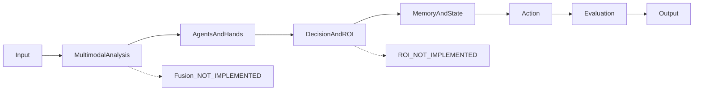

# Atlas → VOLAURA Learning Engine: Technical Handoff

Date: 2026-07-25  
Audience: AI engineer implementing the integration  
Scope inspected: `C:\Users\user\OneDrive\Documents\GitHub\ANUS` only  
VOLAURA product code: not inspected; atlas-builder lane forbids work in that repo  
Status vocabulary: **READY / PARTIAL / IDEA / NOT IMPLEMENTED**

## 0. Verified baseline

| Claim | Evidence | Status |
|---|---|---|
| Repository | `https://github.com/ganbaroff/atlas-cli` (`git remote get-url origin`, GitHub metadata) | READY |
| Visibility | GitHub `visibility=PUBLIC`, `isPrivate=false` | READY |
| Default/current branch | `main` | READY |
| Latest verified commit | `a7f81ee5f3eb4d4cfbbdc64822d768e2bc97218d` — `feat(m8): goal-runner terminal status writes evidence ledger claim — Sprint E closed` | READY |
| Latest CI | GitHub Actions run `30134222010`, conclusion `success`, same head SHA | READY |
| CI test result | 106 test files passed, 1 skipped; 823 tests passed, 3 skipped; duration 61.36s | READY |
| State document freshness | `docs/atlas-cto/ATLAS-STATE-NOW.md` still cites older tips `ae79bf2` / `9f0a831` | PARTIAL / stale documentation |

---

## 1. What Atlas is

### Product task

Atlas is a persistent AI-agent control surface: CLI, Telegram runtime, model routing, bounded goal execution, evidence-gated delegation, memory, provider health, spend controls, and audit trails.

- Module/evidence: `README.md`, `ATLAS-CANON.md`, `docs/architecture/ATLAS-ARCHITECTURE.md`
- Runtime APIs: `src/cli.ts`, `src/telegram.ts`, `src/agent.ts`
- Status: **READY**

Atlas is not currently a Learning Engine and has no learner mastery model.

- Negative evidence: no `next best learning action`, `learning engine`, `mastery`, learner recommendation, or pedagogical ROI module under `src/`
- Status: **NOT IMPLEMENTED**

### “Atlas CI”

There is no named product capability called “Atlas CI” in code or docs.

- Existing meaning: standard GitHub continuous integration
- File: `.github/workflows/ci.yml`
- Pipeline: clean checkout → Node 22 → `npm ci --legacy-peer-deps` → Playwright Chromium → `npm run build` → `npx tsc --noEmit` → `npx vitest run`
- Status: **READY as CI/CD validation; NOT IMPLEMENTED as a product intelligence concept**

### Agentic ROI

No agentic ROI model exists.

- Search evidence: no ROI API, schema, formula, table, or module
- Nearest modules:
  - LLM cost: `src/atlas/spend-tracker.ts` → `estimateCostUsd()`
  - swarm comparison: `src/research-swarm/eval-harness.ts` → `buildEvalReport()`
  - operator quality: `src/operator/evaluator.ts` → `evaluateOperatorResult()`
- Status: **NOT IMPLEMENTED**

Proposed integration definition:

```text
agentic_roi =
  expected_learning_gain
  - model_cost
  - latency_penalty
  - human_review_cost
  - failure/privacy_risk
```

- Source: proposed in this handoff
- Status: **IDEA**

### Multimodal ROI

No multimodal ROI model exists. Text, voice, and screen vision are separate pipelines; no cross-modal comparison or fusion layer exists.

- Evidence: `src/telegram.ts`, `src/atlas/screen-capture.ts`
- Status: **NOT IMPLEMENTED**

Proposed integration definition:

```text
multimodal_roi(modality) =
  incremental_assessment_gain(modality)
  - processing_cost
  - latency_penalty
  - privacy_risk
```

- Source: proposed in this handoff
- Status: **IDEA**

### Decision Atlas makes better than a plain LLM chat

Atlas can make a bounded, auditable execution decision: route work to a constrained hand/provider, persist state, require evidence, deterministically verify a receipt, stop on red-line effects, and preserve a hash-chained audit trail.

- Goal orchestration: `src/goal-runner/runner.ts` → `runGoal()`
- Task authority: `src/exec-graph/api.ts`
- Delegation: `src/hands/exec-graph-adapter.ts`
- Deterministic verification: `src/hands/verifier.ts`
- Evidence: `src/evidence/ledger.ts`
- Spend/provider controls: `src/atlas/spend-policy.ts`, `src/atlas/provider-health.ts`
- Status: **PARTIAL** — only browser execution is wired in `runGoal()`; other hand IDs are aborted as “hand execution not yet implemented”

Atlas does not currently make a better pedagogical Next Best Action decision because that decision logic is absent.

- Status: **NOT IMPLEMENTED**

---

## 2. Code location and local run

| Item | Value | Evidence | Status |
|---|---|---|---|
| Repository | `https://github.com/ganbaroff/atlas-cli` | git remote / GitHub metadata | READY |
| Visibility | Public | GitHub metadata | READY |
| Main branch | `main` | git / GitHub metadata | READY |
| Working commit | `a7f81ee5f3eb4d4cfbbdc64822d768e2bc97218d` | git + green CI | READY |
| Package | `@ganbaroff/atlas-cli` | `package.json` | READY |
| Runtime | Node `>=22.13.0`, ESM | `package.json` | READY |

Related repositories/systems:

| Repository/system | Relationship | Evidence | Status |
|---|---|---|---|
| `C:\Projects\VOLAURA` | Canonical Atlas memory + Python swarm + product ecosystem state | `ATLAS-CANON.md`; `src/atlas/python-bridge.ts` | READY locally when present |
| `C:\Projects\OPSBOARD-PRO` | File-exchange GoalRequest/GoalReceipt integration | `src/opsboard/goal-request-port.ts`; `docs/atlas-cto/M9-LIVE-CROSS-REPO-RECEIPT-2026-07-25.md` | PARTIAL; remote push documented open |
| Supabase | Session mirror, emotional memory, command queue, spend telemetry | `src/atlas/supabase-memory.ts`; `db/` | PARTIAL |
| Railway | Always-on Telegram bot container | `Dockerfile`; `railway.json` | READY deployment substrate; latest-tip redeploy not proven |

Local launch:

```powershell
git clone https://github.com/ganbaroff/atlas-cli.git
cd atlas-cli
npm ci --legacy-peer-deps
Copy-Item .env.example .env
# configure at least one provider key
npm run build
node dist/cli.js health
node dist/cli.js chat
```

Development and verification:

```powershell
npm run dev -- chat
npm run typecheck
npm test -- --run
```

- Evidence: `README.md`, `package.json`
- Status: **READY**

Telegram runtime:

```powershell
node dist/cli.js telegram
```

- Required auth/config: `TELEGRAM_BOT_TOKEN`, `TELEGRAM_CEO_CHAT_ID`
- Evidence: `src/telegram.ts`
- Status: **READY**

---

## 3. Architecture



Current concrete flow:

```text
CLI/Telegram text or Telegram voice
→ auth/control gate
→ brain planner + emotion context
→ cost/health-aware model router
→ Atlas agent or research swarm
→ goal-runner / operator / hand adapter
→ exec-graph + budgets + evidence ledger
→ browser/local/swarm action where wired
→ deterministic verifier / operator evaluator / swarm judge
→ CLI JSON/text or Telegram reply
```

### Component map

| Component | Implementation | API | Status |
|---|---|---|---|
| Frontend | Telegram + CLI; Windows PowerShell tray | `src/telegram.ts`, `src/cli.ts`, `apps/desktop/atlas-tray.ps1` | READY/PARTIAL |
| Web frontend | None | — | NOT IMPLEMENTED |
| Backend | Node/TypeScript process; Telegram polling; health HTTP server | `src/telegram.ts`, `GET /health` only | PARTIAL |
| Product HTTP API | None beyond `/health` | — | NOT IMPLEMENTED |
| Orchestrator | Mastra agents + brain planner + goal runner + operator | `src/agent.ts`, `src/atlas/brain-planner.ts`, `src/goal-runner/runner.ts`, `src/operator/*` | PARTIAL |
| Agent runtime | Mastra `Agent` | `createAtlasAgent()`, inline Telegram/worker/judge agents | READY |
| Tools | read/write/glob/grep/shell/skills/surf/wiki | `src/tools/*` | READY for CLI/API agents; Telegram agent has no tools |
| Task memory/state | append-only exec-graph + snapshot | `state/exec-graph/ledger.jsonl`, `graph.json`; `src/exec-graph/*` | READY local |
| Goal budgets | file-backed budget/lease | `src/goal-runner/budgets.ts`; `state/goal-budgets/` | READY |
| Evidence | hash chain + auditor | `src/evidence/ledger.ts`, `src/evidence/auditor.ts` | READY |
| Long-term memory | file canon + Supabase mirror/emotional memory | `src/atlas/memory-manager.ts`, `src/atlas/supabase-memory.ts` | PARTIAL |
| Queue | Supabase command queue + optional local worker | `atlas_command_queue`; `src/atlas/queue-worker.ts` | PARTIAL; producer path dormant |
| Models | 9 providers, role/cost routing | `src/model-router.ts` | READY |
| Provider health | durable dead/degraded/healthy state | `src/atlas/provider-health.ts` | READY |
| FinOps | token/cost meter, local receipt, Supabase row | `src/atlas/spend-tracker.ts` | READY with static pricing limitations |
| External APIs | Telegram, Supabase PostgREST/RPC, model providers, OpenAI Whisper, optional web fetch | respective modules | PARTIAL |

### Local/cloud boundary

- Railway runs `node dist/cli.js telegram`.
  - Evidence: `Dockerfile`
  - Status: **READY**
- Railway exposes only `GET /health`.
  - Evidence: `src/telegram.ts`
  - Status: **READY**
- Exec-graph writes are local, not a cloud multi-tenant service.
  - Evidence: `docs/architecture/ATLAS-ARCHITECTURE.md`, `src/exec-graph/*`
  - Status: **READY local / NOT IMPLEMENTED cloud**
- Canonical Atlas memory remains in VOLAURA.
  - Evidence: `ATLAS-CANON.md`
  - Status: **READY but transitional architecture**

---

## 4. Agents and hands

Important distinction:

- Mastra agents are executable model sessions.
- Hands are declarative capability contracts. A hand is not automatically an executable agent.
- Evidence: `src/agent.ts`, `src/hands/registry.ts`, `src/hands/manifests/*.json`
- Status: **READY distinction; PARTIAL execution wiring**

### Executable agents

| Name/id | Task | Input | Output | Model | Tools | Prompt | Code | Status |
|---|---|---|---|---|---|---|---|---|
| `atlas-core` | General CLI/API work | prompt/messages + role/channel | model text/tool calls | dynamic `routeModel()`; Anthropic excluded in `src/agent.ts` | read/write/glob/grep/shell/skills/surf; API wrapper also wiki | `buildAtlasBrainPlan()` → `buildAtlasSystemPrompt()` | `src/agent.ts`, `src/atlas/mastra-agent.ts` | READY |
| `atlas-telegram` | CEO chat reply | conversation messages + system prompt | reply text + turn evidence | `routeModelWithFallback(WORKER)` | none | brain planner system prompt | `src/telegram.ts` → `generateWithFallback()` | READY |
| `atlas-emotion` | PAD emotional classification | last 1–3 text messages | JSON: valence/arousal/dominance/state | dynamic FAST route | none | fixed JSON-only classifier prompt | `src/atlas/emotion.ts` → `readEmotionLLM()` | PARTIAL; keyword fallback |
| `atlas-worker` | One research perspective | perspective instruction + task | worker evidence/output | `routeWorkerProvider()` | none | brain planner system prompt + perspective task | `src/research-swarm/lifecycle.ts` | READY |
| `atlas-judge` | Synthesize worker claims/dissent | worker evidence + task | synthesis, claims, dissent, consensus | `routeJudgeProvider()` | none | `buildJudgePrompt()` + brain plan | `src/research-swarm/synthesis.ts` | READY |
| `atlas-surf-extractor` | Structure fetched webpage content | request + page text | JSON string | dynamic WORKER, Anthropic excluded | none | fixed extraction prompt | `src/tools/surf.ts` | PARTIAL; fetched content is untrusted input |

### Swarm perspectives

Default perspectives:

| Name | Prompt/instruction | Provider | Evidence | Status |
|---|---|---|---|---|
| `reviewer-1` | correctness, edge cases, failures | dynamic | `src/atlas/perspectives.ts` | READY |
| `reviewer-2` | simplicity, unnecessary complexity | dynamic | same | READY |
| `reviewer-3` | security, hostile input | dynamic | same | READY |

Custom perspectives can be loaded from `ATLAS_PERSPECTIVES_PATH` or `~/.atlas/perspectives.json`.

- API: `PERSPECTIVES`, `assignPerspectives()`
- Evidence: `src/atlas/perspectives.ts`
- Status: **READY**

### Registered hands

| Hand | Task | Input/output | Model/tools | Code | Status |
|---|---|---|---|---|---|
| `browser-foreground` | Typed local/fixture browser actions | `DelegationBrief` → browser receipt | Playwright; no fixed model | `src/hands/manifests/browser-foreground.json`, `src/hands/browser-adapter.ts` | READY only when `browserActions` supplied |
| `swarm-local` | Multi-perspective analysis | task → swarm artifact/receipt | routed workers/judge | `src/hands/manifests/swarm-local.json`, `src/swarm-exec/*` | READY |
| `local-readonly` | Read-only inspection | brief → expected receipt | declarative only | manifest | NOT IMPLEMENTED in goal runner |
| `file-search` | Local recursive name/content search | root/pattern → hits | `runFileSearch()` | `src/hands/file-search.ts` | PARTIAL; implementation exists, goal-runner wiring absent |
| `sonnet-foreground` | Human-observed scoped code work | brief → receipt | no direct Sonnet executor bound | manifest | NOT IMPLEMENTED in goal runner |

### Agent handoff

```text
Goal/task
→ assignHand(taskId, handId)
→ task owner becomes hand:<id>
→ executor produces Receipt
→ submitReceipt()
→ verifyAndTransition()
→ deterministic verifier
→ optional refuter for non-low risk
→ verified or rejected
```

- APIs: `assignHand()`, `submitReceipt()`, `verifyAndTransition()`, `abortHandTask()`
- Module: `src/hands/exec-graph-adapter.ts`
- Status: **READY contract; PARTIAL executors**

Research swarm handoff:

```text
PERSPECTIVES
→ parallel atlas-worker agents
→ provenance-bearing WorkerEvidence
→ deduped claims + dissent
→ atlas-judge
→ diversity/status decision
→ artifact
```

- Modules: `src/research-swarm/lifecycle.ts`, `synthesis.ts`, `diversity.ts`, `artifact.ts`
- Status: **READY / RESEARCH_ONLY_LIMITED**

---

## 5. ROI engine

### Current implementation

| Requirement | Evidence | Status |
|---|---|---|
| ROI definition | no module/schema/table | NOT IMPLEMENTED |
| Alternative action generation | no learner action generator | NOT IMPLEMENTED |
| Alternative comparison | no `compareAlternatives()`/ranker | NOT IMPLEMENTED |
| Pedagogical confidence | no learning confidence model | NOT IMPLEMENTED |
| Human approval | generic gates exist, not NBA-specific | PARTIAL |

### Existing scoring logic that can be reused

1. LLM spend:

```text
cost =
  tokens_in / 1,000,000 * price_in
  + tokens_out / 1,000,000 * price_out
```

- API: `estimateCostUsd()`
- File: `src/atlas/spend-tracker.ts`
- Status: **READY, static price map**

2. Operator quality:

```text
passed = issues.length === 0
score = passed ? 100 : max(0, 100 - issues.length * 20)
```

- API: `evaluateOperatorResult()`
- File: `src/operator/evaluator.ts`
- Status: **READY but not pedagogical**

3. Research diversity:

```text
limited diversity: >= 2 successful providers
strong consensus: >= 3 successful model families
```

- API: `evaluateDiversity()`, `deriveStatusFromDiversity()`
- File: `src/research-swarm/diversity.ts`
- Status: **READY but not ROI**

4. Evidence confidence:

- Field: `TypedClaim.confidence` in range 0–1
- Narrative confidence forced to 0
- File: `src/evidence/claim.ts`
- Status: **READY evidence schema; not a calibrated prediction confidence**

### Proposed NBA scoring

```text
utility(action) =
  0.30 * expected_mastery_gain
  + 0.20 * gap_urgency
  + 0.15 * retention_need
  + 0.15 * attention_energy_fit
  + 0.10 * modality_fit
  + 0.10 * evidence_confidence
  - latency_penalty
  - token_cost_penalty
  - privacy_risk_penalty
```

- Source: proposed in this handoff
- Status: **IDEA; founder must ratify weights/objective**

Alternative comparison should be deterministic first:

1. Generate finite candidate actions.
2. Normalize factors to 0–1.
3. Calculate utility for each candidate.
4. Return top action plus ordered alternatives.
5. Use a judge agent only for rationale/ambiguity, not as sole scorer.
6. Escalate if score margin between top two actions is below threshold or evidence is missing.

- Status: **IDEA**

Human approval:

- Existing generic TTY capability: `src/hands/assist-approval-port.ts`
- Existing escalation: exec-graph `escalated`
- Existing red-line action result: `src/atlas/action-router.ts`
- NBA approval policy: **NOT IMPLEMENTED**

---

## 6. Multimodal

| Format | Real pipeline | Evidence | Status |
|---|---|---|---|
| Text | Telegram/CLI text → brain planner → routed model → reply/state | `src/telegram.ts`, `src/cli.ts`, `src/atlas/brain-planner.ts` | READY |
| Voice | Telegram OGG → temp file → OpenAI `/v1/audio/transcriptions`, model `whisper-1` → text → normal text pipeline → temp delete | `src/telegram.ts` → `transcribe()`, `bot.on('voice')` | PARTIAL; requires `OPENAI_API_KEY`, no dedicated live CI test |
| Images | Primary-screen PNG/JPEG → optional base64 `image_url` → freellmapi Gemini → secret-redacted summary | `src/atlas/screen-capture.ts` | PARTIAL; screen only, opt-in, Windows capture |
| Arbitrary uploaded image | No Telegram photo handler | `src/telegram.ts` has no `photo` handler | NOT IMPLEMENTED |
| Video | No ingest/decode/frame/audio pipeline | no module | NOT IMPLEMENTED |
| Documents | Plain-text read/grep/file-search only | `src/tools/read-file.ts`, `grep.ts`, `src/hands/file-search.ts` | PARTIAL |
| PDF/DOCX/OCR | No parser/router | no module | NOT IMPLEMENTED |
| User behavior | CLI command analytics + hostname-derived PostHog ID; text emotion PAD | `src/analytics.ts`, `src/atlas/emotion.ts` | PARTIAL; not learner behavior |
| Learning behavior | Errors, answer time, mastery, attention model | no module | NOT IMPLEMENTED |
| Cross-modal fusion | No common observation schema/fusion/scorer | no module | NOT IMPLEMENTED |

---

## 7. VOLAURA integration: Next Best Learning Action

### Reusable Atlas modules

| Reuse | API/module | Status |
|---|---|---|
| Input validation | Zod pattern in `src/hands/contract.ts`, `src/operator/contracts.ts` | READY |
| Provider routing | `routeModel()`, `routeModelWithFallback()` | READY |
| Provider health | `isProviderHealthyForRouting()` | READY |
| Spend controls | `enforceSpendPolicy()`, `recordSpend()` | READY |
| Parallel analysis | `runResearchSwarm()` | READY / research-limited |
| Claims/dissent | `buildClaimsFromWorkers()`, `runJudge()` | READY |
| Durable action state | `src/exec-graph/api.ts` | READY local |
| Human escalation | exec-graph `escalated`, notify gate | PARTIAL |
| Evidence | `appendClaim()`, `verifyLedgerChain()` | READY |
| External integration pattern | M9 `GoalRequest`/`GoalReceipt` file exchange | READY mechanism |
| Read-only mode | `assertWritable()`, `isAtlasReadonly()` | READY |
| Single-writer lease | `src/atlas/instance-lease.ts` | READY |

### Required additions

| Addition | Proposed path | Status |
|---|---|---|
| Learner snapshot schema | `src/learning/contracts.ts` | IDEA |
| Candidate action schema | same | IDEA |
| Deterministic ranker | `src/learning/nba-engine.ts` | IDEA |
| One-lesson adapter | `src/learning/lesson-adapter.ts` | IDEA |
| Integration port | `src/learning/request-port.ts` | IDEA |
| HTTP endpoint | `src/learning/http.ts` | IDEA; Atlas has no authenticated product API |
| NBA evidence writer | `src/learning/evidence-writeback.ts` | IDEA |
| Human review workflow | `src/learning/review-policy.ts` | IDEA |
| Multimodal observation contract | `src/learning/multimodal.ts` | IDEA |
| Calibration/eval dataset | `fixtures/learning/*.json` | IDEA |

### Recommended transport

Sprint 1 should use an M9-style file exchange because it is already proven and avoids inventing HTTP auth before VOLAURA’s auth contract is known.

- Existing pattern: `src/opsboard/goal-request-port.ts`
- Live evidence: `docs/atlas-cto/M9-LIVE-CROSS-REPO-RECEIPT-2026-07-25.md`
- Status: **IDEA based on READY pattern**

Production target should later be an authenticated HTTP API owned by a separate service boundary, not added casually to the Telegram health server.

- Current API: `/health` only
- VOLAURA auth/RBAC: **UNKNOWN**
- Status: **IDEA**

### Proposed request

```json
{
  "schemaVersion": 1,
  "correlationId": "corr_01J...",
  "learnerId": "opaque_volaura_id",
  "lessonId": "lesson_123",
  "issuedAt": "2026-07-25T01:00:00.000Z",
  "goal": {
    "type": "mastery",
    "targetCompetencies": ["fractions.addition"]
  },
  "responses": [
    {
      "questionId": "q_1",
      "answer": "3/8",
      "correct": false,
      "errorCode": "common_denominator",
      "responseTimeMs": 18200,
      "userConfidence": 0.7
    }
  ],
  "masteryMap": {
    "fractions.basics": 0.82,
    "fractions.common_denominator": 0.31
  },
  "learningHistory": [
    {
      "lessonId": "lesson_100",
      "completedAt": "2026-07-24T10:00:00.000Z",
      "score": 0.64
    }
  ],
  "state": {
    "energy": 0.45,
    "attention": 0.52
  },
  "attachments": [
    {
      "type": "voice",
      "ref": "volaura://artifact/audio_123",
      "consent": true
    }
  ],
  "constraints": {
    "allowedFormats": ["text", "audio", "video", "diagram", "cards", "grill_me"],
    "maxDurationSeconds": 300,
    "requireHumanReview": false
  }
}
```

- Status: **IDEA**

### Proposed response

```json
{
  "schemaVersion": 1,
  "correlationId": "corr_01J...",
  "decisionId": "nba_01J...",
  "status": "ready",
  "understanding": {
    "understood": ["fractions.basics"],
    "gap": ["fractions.common_denominator"],
    "evidenceRefs": ["clm_01J..."]
  },
  "nextAction": {
    "type": "targeted_practice",
    "targetCompetency": "fractions.common_denominator",
    "format": "diagram",
    "difficulty": 0.42,
    "durationSeconds": 240,
    "reason": "Recent error and low mastery indicate a denominator-model gap; attention is insufficient for a long video."
  },
  "alternatives": [
    {
      "format": "cards",
      "utility": 0.68
    },
    {
      "format": "grill_me",
      "utility": 0.51
    }
  ],
  "confidence": 0.74,
  "humanReviewRequired": false,
  "scoring": {
    "expectedMasteryGain": 0.72,
    "gapUrgency": 0.83,
    "retentionNeed": 0.57,
    "attentionEnergyFit": 0.81,
    "modalityFit": 0.76,
    "evidenceConfidence": 0.7,
    "latencyPenalty": 0.03,
    "tokenCostPenalty": 0.0,
    "privacyRiskPenalty": 0.02,
    "utility": 0.71
  },
  "audit": {
    "provider": "nvidia",
    "model": "meta/llama-3.3-70b-instruct",
    "evidenceEntryHash": "sha256...",
    "policyVersion": "nba-v1"
  }
}
```

- Status: **IDEA**

### Required APIs

| API | Purpose | Current status |
|---|---|---|
| `POST /v1/learning/next-action` | Compute recommendation | NOT IMPLEMENTED |
| `GET /v1/learning/decisions/{decisionId}` | Return decision + audit refs | NOT IMPLEMENTED |
| `POST /v1/learning/decisions/{decisionId}/feedback` | Actual outcome for calibration | NOT IMPLEMENTED |
| `POST /v1/learning/decisions/{decisionId}/review` | Approve/reject/override | NOT IMPLEMENTED |
| `GET /v1/learning/health` | Dependency/model/policy health | NOT IMPLEMENTED |
| `GET /health` | Current Telegram runtime health | READY |

### Required tables

Do not repurpose `atlas_learnings`; it stores Atlas emotional memory, not learner mastery.

Existing evidence:

- Table: `public.atlas_learnings`
- File: `db/migrations/001_emotional_memory.sql`
- Status: **READY for Atlas memory; wrong domain for learner state**

Proposed tables:

```sql
-- IDEA: Atlas decision audit, not learner source-of-truth
learning_decision_runs (
  id uuid primary key,
  correlation_id text unique not null,
  learner_id text not null,
  lesson_id text,
  input_snapshot jsonb not null,
  candidates jsonb not null,
  selected_action jsonb,
  confidence numeric,
  policy_version text not null,
  provider text,
  model text,
  human_review_required boolean not null,
  status text not null,
  evidence_entry_hash text,
  created_at timestamptz not null
);

learning_decision_feedback (
  id uuid primary key,
  decision_id uuid not null,
  observed_outcome jsonb not null,
  mastery_delta numeric,
  engagement_delta numeric,
  created_at timestamptz not null
);

learning_decision_reviews (
  id uuid primary key,
  decision_id uuid not null,
  reviewer_id text not null,
  verdict text not null,
  override_action jsonb,
  reason text,
  created_at timestamptz not null
);
```

- Status: **IDEA**
- Learner/mastery/lesson source tables: **UNKNOWN; must be supplied by VOLAURA lane**

---

## 8. Data and security

### Existing database schema

| Table/RPC | Purpose | Evidence | Status |
|---|---|---|---|
| `public.atlas_learnings` | Emotional-decay memory | `db/migrations/001_emotional_memory.sql` | READY |
| `recall_atlas_memories()` | Ranked recall | same | READY |
| `bump_recall_count()` | Recall write-back | same | READY |
| `public.llm_spend` | One row per LLM call | `db/llm_spend.sql` | READY |
| `llm_spend.correlation_id` | Correlation lookup | `db/llm_spend_correlation_id.sql` | READY |
| `bot_sessions` | Telegram sessions | referenced in `src/atlas/supabase-memory.ts` | PARTIAL; no versioned DDL |
| `bot_messages` | Telegram content | same | PARTIAL; no versioned DDL |
| `bot_heartbeats` | bot heartbeat | comments/docs | PARTIAL; no versioned DDL |
| `atlas_command_queue` | legacy remote command transport | `supabase-memory.ts`, `docs/QUEUE-CONTRACT.md` | PARTIAL; no versioned DDL |
| `claim_next_command()` | atomic queue claim | `supabase-memory.ts` | PARTIAL; no versioned DDL |
| `sweep_stale_commands()` | queue TTL recovery | same | PARTIAL; no versioned DDL |

### Auth and roles

| Control | Evidence | Status |
|---|---|---|
| Telegram single-owner auth by `TELEGRAM_CEO_CHAT_ID` | `src/telegram.ts`, `src/atlas/telegram-auth.ts` | READY, fail-closed |
| Supabase service-role access | `src/atlas/supabase-memory.ts` | READY but broad privilege |
| RLS on `atlas_learnings` and `llm_spend` | SQL migrations | READY |
| Learning API auth | no API | NOT IMPLEMENTED |
| Multi-tenant learner RBAC | no schema/middleware | NOT IMPLEMENTED |

### Personal data

- Telegram message content and chat IDs are persisted.
  - Module: `src/atlas/supabase-memory.ts`
  - Tables: `bot_messages`, `bot_sessions`
  - Status: **PARTIAL**
- Local conversation JSONL is plaintext.
  - Module: `src/atlas/conversation-store.ts`
  - Status: **PARTIAL**
- Voice is downloaded to OS temp and deleted in `finally`.
  - Module: `src/telegram.ts` → `transcribe()`
  - External processor: OpenAI Whisper
  - Status: **PARTIAL**
- Screen capture may contain personal data; vision is opt-in and summaries are regex-redacted.
  - Module: `src/atlas/screen-capture.ts`
  - Status: **PARTIAL**
- No learner consent, retention, deletion/export, or data residency policy exists.
  - Status: **NOT IMPLEMENTED**

### File storage

| Data | Location | Status |
|---|---|---|
| Exec state | `state/exec-graph/` | READY local |
| Goal budgets | `state/goal-budgets/` | READY local |
| Evidence | `state/evidence/` | READY local |
| Operator results | `operator/runs/` | READY local |
| Swarm artifacts | configured memory root / swarm-runs | READY local |
| Spend receipts | `~/.atlas/spend-receipts.jsonl` | READY local |
| Provider health | `~/.atlas/provider-health.json` or override | READY local |
| Screen captures | temp / `ATLAS_CAPTURE_DIR` | PARTIAL |
| Railway memory | `/app/memory/...`; persistence depends on external Railway Volume | PARTIAL |

### Logs and audit

- Exec-graph append-only ledger: **READY**
- M8 hash-chained evidence ledger/auditor: **READY**
- Spend local receipt + Supabase row: **READY**, local receipt not hash-chained
- Shell audit JSONL: **READY**
- Central log aggregation: **NOT IMPLEMENTED**

### Secrets

- Secrets come from env/Railway vars.
  - Evidence: `src/model-router.ts`, `.env.example`, `Dockerfile`
  - Status: **READY pattern**
- File tools block sensitive paths.
  - Module: `src/tools/fs-guard.ts`
  - Status: **READY**
- Receipts are secret-scanned before append.
  - Module: `src/hands/exec-graph-adapter.ts`
  - Status: **READY**
- No pre-commit secret scanner or CI SAST/dependency scan.
  - Workflow: `.github/workflows/ci.yml`
  - Status: **NOT IMPLEMENTED**

### Main vulnerabilities

| Risk | Evidence | Status |
|---|---|---|
| Service-role key compromise gives broad Supabase access | `supabase-memory.ts` uses service role | OPEN RISK |
| Conversation/learning PII has no retention/deletion policy | no module/policy | OPEN RISK |
| Telegram auth is single ID, no learner/user auth | `telegram.ts` | OPEN RISK for Learning API |
| Web content and user prompts can carry prompt injection | `src/tools/surf.ts`, model tools | OPEN RISK |
| Provider health corrupt file fails to empty/healthy state | `src/atlas/provider-health.ts` | OPEN RISK |
| Local spend receipts are mutable JSONL | `spend-tracker.ts` | OPEN RISK |
| Current `SECURITY.md` calls the project experimental despite live Railway use | `SECURITY.md`, deployment docs | DOCUMENTATION/ASSURANCE RISK |
| Runtime state is split across exec-graph, operator, queue, evidence, memory | architecture modules | ARCHITECTURAL COMPLEXITY |

---

## 9. Testing

| Layer | Evidence | Current result | Status |
|---|---|---|---|
| Unit | `src/__tests__/*.test.ts` | included in 823-pass CI | READY |
| Integration | `src/__tests__/integration/*` | compiled binary tests included | READY |
| Browser E2E | `browser-hand.test.ts`, `goal-runner.test.ts`, Playwright in CI | fixture-based | READY/PARTIAL |
| Kill/resume E2E | `m4-kill-resume-e2e.test.ts` | CI-covered | READY |
| Multi-process lease | `m4-instance-lease.test.ts` | CI-covered | READY |
| Install/upgrade/rollback | `m10-install-lifecycle.test.ts` | CI-covered | READY |
| Evidence tamper | `m8-evidence.test.ts` | CI-covered | READY |
| Goal evidence write-back | `m5-goal-evidence-writeback.test.ts` | CI-covered | READY |
| Agent eval | `src/research-swarm/eval-harness.ts` | 2 synthetic fixtures | PARTIAL |
| Live provider benchmark | no CI gate | — | NOT IMPLEMENTED |
| Learning dataset | none | — | NOT IMPLEMENTED |
| NBA calibration | none | — | NOT IMPLEMENTED |
| Voice live test | none | — | NOT IMPLEMENTED |
| Video/image learning assessment E2E | none | — | NOT IMPLEMENTED |
| Load/performance test | none | — | NOT IMPLEMENTED |

Current eval fixtures:

- `evidence-gate-audit`
- `schema-review`

File/API: `src/research-swarm/eval-harness.ts` → `EVAL_FIXTURES`

Measured outputs:

- baseline latency
- swarm latency
- baseline/swarm token count
- swarm status
- provider count
- verdict: `READY_FOR_RESEARCH`, `RESEARCH_ONLY`, `KEEP_DISABLED`

Status: **PARTIAL; not a learning benchmark**

Required Learning Engine datasets:

1. Gold-standard learner snapshots with expert-selected next actions.
2. Misconception taxonomy.
3. Modality preference/efficacy outcomes.
4. Human review disagreements.
5. Longitudinal mastery delta after recommendation.

- Status: **NOT IMPLEMENTED**

---

## 10. Infrastructure

| Item | Implementation | Status |
|---|---|---|
| Cloud | Railway | READY |
| Container | Node 22 Alpine Dockerfile | READY |
| Process | `node dist/cli.js telegram` | READY |
| Health | `/health`, 30s Railway timeout | READY |
| Restart | `ON_FAILURE`, max 5 | READY |
| CI | GitHub Actions on push/PR | READY |
| CD | no deploy step in `.github/workflows/ci.yml` | PARTIAL/manual |
| VM/functions/Cloud Run | none | NOT IMPLEMENTED |
| Staging | none documented | NOT IMPLEMENTED |

Cost:

- Free/local providers are estimated as `$0` by `PRICE_PER_MILLION`.
- Paid calls use static estimated prices.
- A full research swarm cost is the sum of worker + judge calls through `recordAgentSpend()`.
- Exact per-run cost cannot be stated without actual token counts and provider route.
- Evidence: `src/atlas/spend-tracker.ts`, `src/research-swarm/lifecycle.ts`, `synthesis.ts`
- Status: **READY metering / PARTIAL accuracy**

Limits:

| Limit | Default | Evidence | Status |
|---|---|---|---|
| Daily tokens | 500,000 | `src/atlas/spend-policy.ts` | READY |
| Paid providers | disabled unless `ATLAS_ALLOW_PAID=1` | same | READY |
| Swarm routing | 10s | `src/research-swarm/timeouts.ts` | READY |
| Swarm worker | 60s | same | READY |
| Swarm judge | 45s | same | READY |
| Swarm global | 180s | same | READY |
| Goal wall time | 300s | `src/goal-runner/types.ts` | READY |
| Screen vision | policy hourly cap | `screen-capture.ts`, policy | READY |

---

## 11. Current feature status

| Feature | Status | Evidence/file | Quality | Blocker |
|---|---|---|---|---|
| CLI | READY | `src/cli.ts` | CI-covered | none |
| Telegram text | READY | `src/telegram.ts` | deployed pattern, auth gate | single-owner only |
| Telegram voice | PARTIAL | `transcribe()` | graceful fallback | OpenAI key; no live test |
| Model routing | READY | `src/model-router.ts` | health/cost/fallback tested | static registry/prices |
| Research swarm | PARTIAL | `src/research-swarm/*` | provenance/diversity/eval | RESEARCH_ONLY_LIMITED |
| Exec-graph | READY local | `src/exec-graph/*` | append-only/evidence-gated | no cloud writer |
| Goal runner | PARTIAL | `src/goal-runner/runner.ts` | budgets/resume/red-lines | only browser executor wired |
| Hands registry | READY | `src/hands/manifests/*.json` | schema-tested | specs exceed executors |
| Browser hand | READY/PARTIAL | `src/hands/browser-adapter.ts` | fixture-tested | no arbitrary external target |
| Supervised assist | READY local | `src/hands/supervised-assist.ts` | TTY/hash/single-use gate | no remote approval |
| Evidence ledger | READY | `src/evidence/*` | hash chain + audit | local file store |
| Goal evidence write-back | READY/PARTIAL | `evidence-writeback.ts` | CI-covered | fail-open; narrative confidence 0 |
| Emotional memory | READY/PARTIAL | migration + `supabase-memory.ts` | deterministic decay | CEO memory, not learner memory |
| Spend telemetry | READY | `llm_spend`, `spend-tracker.ts` | local+Supabase | static prices, mutable local file |
| Screen vision | PARTIAL | `screen-capture.ts` | redaction/rate tests | screen only, opt-in |
| Learning Engine | NOT IMPLEMENTED | no module | none | contracts/data/policy absent |
| NBA engine | NOT IMPLEMENTED | no module | none | scoring/calibration absent |
| Agentic ROI | NOT IMPLEMENTED | no module | none | objective/weights absent |
| Multimodal ROI | NOT IMPLEMENTED | no module | none | fusion/outcome data absent |

---

## 12. Technical debt

1. Goal runner advertises five hands but executes only `browser-foreground` with supplied actions.
   - Evidence: `src/goal-runner/runner.ts`
   - Status: **PARTIAL**

2. Goal decomposition is one deterministic task; no bounded LLM decomposition.
   - Evidence: `decomposeObjective()` in `runner.ts`
   - Status: **PARTIAL**

3. Core operational state is split across exec-graph, operator JSON, command queue, evidence ledger, goal budgets, and memory.
   - Evidence: architecture modules
   - Status: **OPEN DEBT**

4. Supabase bot/queue schemas are referenced but not versioned.
   - Evidence: `src/atlas/supabase-memory.ts`; no matching migration
   - Status: **OPEN DEBT**

5. `ATLAS-STATE-NOW.md` cites stale HEADs and test counts.
   - Evidence: file vs git/CI baseline above
   - Status: **OPEN DEBT**

6. `SECURITY.md` assurance level conflicts with live deployment reality.
   - Evidence: `SECURITY.md`, `Dockerfile`, Railway docs
   - Status: **OPEN DEBT**

7. Goal terminal evidence uses narrative claim with confidence 0 and fail-open write.
   - Evidence: `src/goal-runner/evidence-writeback.ts`
   - Status: **PARTIAL**

8. No calibrated false-positive penalty/effective confidence implementation.
   - Evidence: M8 schema exists; no runtime calibration module
   - Status: **NOT IMPLEMENTED**

9. Voice depends on a paid OpenAI endpoint while model routing is otherwise free-first.
   - Evidence: `src/telegram.ts`
   - Status: **OPEN DEBT**

10. No video, arbitrary image, PDF/DOCX, or multimodal fusion pipeline.
    - Status: **NOT IMPLEMENTED**

11. Prompt-injection risk remains for fetched web content and model/tool loops.
    - Evidence: `src/tools/surf.ts`, `src/agent.ts`
    - Status: **OPEN RISK**

12. Learning recommendations have no outcome feedback/calibration loop.
    - Status: **NOT IMPLEMENTED**

Most dangerous architectural decisions:

- Adding learner data to `atlas_learnings`: wrong domain and retention model.
- Giving Learning API the Supabase service-role key directly.
- Letting an LLM choose NBA without a deterministic candidate/ranking layer.
- Auto-applying low-confidence recommendations without human review.
- Extending the Telegram `/health` server into a product API without explicit auth/RBAC.
- Duplicating learner truth in Atlas and VOLAURA.

All six are **IDEA-level risks**, not current implemented behavior.

---

## 13. Fifteen files to read first

1. `README.md` — supported surfaces, commands, local/cloud split.
2. `docs/architecture/ATLAS-ARCHITECTURE.md` — component and authority map.
3. `ATLAS-CANON.md` — ANUS/VOLAURA source-of-truth split.
4. `src/cli.ts` — public CLI command surface.
5. `src/telegram.ts` — deployed bot, auth, text/voice, health.
6. `src/agent.ts` — primary Mastra agent factory and tools.
7. `src/atlas/brain-planner.ts` — prompt/context/memory/emotion assembly.
8. `src/model-router.ts` — providers, roles, fallback, cost tiers.
9. `src/research-swarm/lifecycle.ts` — worker orchestration.
10. `src/research-swarm/synthesis.ts` — claims, dissent, judge.
11. `src/goal-runner/runner.ts` — bounded goals, red lines, budgets, execution gap.
12. `src/exec-graph/api.ts` — task-state authority.
13. `src/hands/exec-graph-adapter.ts` — delegation and deterministic closure path.
14. `src/evidence/ledger.ts` — hash-chained audit.
15. `src/atlas/supabase-memory.ts` — DB/session/queue/emotional-memory integration.

Supporting files:

- `src/atlas/spend-tracker.ts`
- `src/atlas/spend-policy.ts`
- `db/migrations/001_emotional_memory.sql`
- `db/llm_spend.sql`
- `.github/workflows/ci.yml`
- `Dockerfile`

---

## 14. Next three sprints

### Sprint 1 — Connect Atlas to one VOLAURA lesson

Concrete result:

```text
One fixed LearnerSnapshot JSON
→ Atlas CLI/file port
→ one structured NbaRecommendation JSON
→ M8 evidence claim
```

Files:

- New `src/learning/contracts.ts`
- New `src/learning/request-port.ts`
- New `src/learning/lesson-adapter.ts`
- `src/cli.ts`
- New `src/__tests__/learning-one-lesson.test.ts`
- New `fixtures/learning/lesson-001.json`

Dependencies:

- VOLAURA must provide one anonymized lesson snapshot and expected expert action.
- Reuse M9 file-exchange pattern.
- No new DB required for Sprint 1.

Complexity: **M**

Done:

- Request/response validate with Zod.
- Duplicate correlation ID is idempotent.
- Missing fields fail closed as `insufficient_data`.
- Recommendation and evidence claim are persisted.
- CI green.
- No VOLAURA product write from Atlas.

Status: **IDEA**

### Sprint 2 — Next Best Learning Action

Concrete result:

```text
Finite candidate actions
→ deterministic weighted score
→ ranked action + alternatives + reason + calibrated confidence
→ feedback endpoint/receipt
```

Files:

- New `src/learning/nba-engine.ts`
- New `src/learning/candidate-generator.ts`
- New `src/learning/review-policy.ts`
- New `src/learning/evidence-writeback.ts`
- `src/model-router.ts` only if a new role is justified
- New `src/__tests__/learning-nba-engine.test.ts`
- New `fixtures/learning/gold/*.json`

Dependencies:

- Founder-ratified optimization objective and weights.
- VOLAURA misconception/mastery schema.
- Expert-labeled gold set.

Complexity: **L**

Done:

- Same input produces deterministic ranking.
- Every score factor is returned.
- Low margin/missing evidence triggers human review.
- Provider failure returns degraded result, never fabricated confidence.
- Outcome feedback can be joined to decision by ID.
- CI + adversarial tests green.

Status: **IDEA**

### Sprint 3 — Multimodal assessment and human validation

Concrete result:

```text
Text + voice + image/video-derived observations
→ normalized observation schema
→ NBA decision
→ reviewer approve/reject/override
→ audited final action
```

Files:

- New `src/learning/multimodal.ts`
- New `src/learning/review-port.ts`
- Extend `src/learning/contracts.ts`
- Reuse patterns from `src/atlas/screen-capture.ts`
- Replace/generalize `src/telegram.ts` Whisper-specific path
- New multimodal fixtures/tests

Dependencies:

- Consent/retention policy.
- Artifact storage and signed reference policy.
- Voice/video processor decision.
- Reviewer identity and SLA.

Complexity: **XL**

Done:

- Attachments are references, not uncontrolled blobs in logs.
- Consent is mandatory for voice/video.
- Per-modality observations retain provenance.
- No publish before approval when policy requires review.
- Reviewer override is immutable/audited.
- False-positive and subgroup evaluation report exists.
- CI and one supervised E2E pass.

Status: **IDEA**

---

## 15. Founder decisions required

Only these decisions cannot be made safely from Atlas code:

1. What is the primary optimization target: immediate correctness, durable mastery, completion speed, engagement, or a weighted combination?
2. Which VOLAURA lesson and learner cohort are the Sprint 1 pilot?
3. Which actions may auto-apply, and which always require a human?
4. What confidence/margin thresholds trigger review or refusal?
5. Who is the reviewer: teacher, VOLAURA operator, founder, or learner?
6. What consent, retention, and deletion policy applies to voice/video and learner records?
7. Are paid providers allowed for production NBA, and what is the per-decision budget?
8. Which formats are actually available in VOLAURA now: text, audio, video, diagram, cards, Grill Me?
9. Is the Sprint 1 transport allowed to be file exchange, or must the pilot start with HTTP?
10. Which system is authoritative for mastery and learning history? Proposed answer: VOLAURA, but this must be ratified.

---

## Compact machine-readable summary

```json
{
  "repository": {
    "url": "https://github.com/ganbaroff/atlas-cli",
    "visibility": "public",
    "branch": "main",
    "verified_commit": "a7f81ee5f3eb4d4cfbbdc64822d768e2bc97218d",
    "ci": {
      "run_id": 30134222010,
      "status": "success",
      "tests_passed": 823,
      "tests_skipped": 3
    }
  },
  "architecture": {
    "frontend": ["CLI", "Telegram", "Windows tray"],
    "backend": "Node.js TypeScript; Telegram polling; GET /health only",
    "orchestrator": ["Mastra Agent", "goal-runner", "operator", "research-swarm"],
    "state": ["exec-graph", "goal-budgets", "evidence ledger", "Supabase mirror"],
    "learning_engine_status": "NOT IMPLEMENTED"
  },
  "agents": [
    {"id": "atlas-core", "status": "READY"},
    {"id": "atlas-telegram", "status": "READY"},
    {"id": "atlas-emotion", "status": "PARTIAL"},
    {"id": "atlas-worker", "status": "READY"},
    {"id": "atlas-judge", "status": "READY"},
    {"id": "atlas-surf-extractor", "status": "PARTIAL"}
  ],
  "roi_engine": {
    "status": "NOT IMPLEMENTED",
    "related_modules": [
      "src/atlas/spend-tracker.ts",
      "src/operator/evaluator.ts",
      "src/research-swarm/eval-harness.ts"
    ]
  },
  "multimodal": {
    "text": "READY",
    "voice": "PARTIAL",
    "screen_image": "PARTIAL",
    "uploaded_image": "NOT IMPLEMENTED",
    "video": "NOT IMPLEMENTED",
    "plain_text_documents": "PARTIAL",
    "pdf_docx_ocr": "NOT IMPLEMENTED",
    "fusion": "NOT IMPLEMENTED"
  },
  "integration_points": [
    "src/model-router.ts",
    "src/research-swarm/lifecycle.ts",
    "src/exec-graph/api.ts",
    "src/hands/exec-graph-adapter.ts",
    "src/evidence/ledger.ts",
    "src/opsboard/goal-request-port.ts",
    "src/atlas/spend-tracker.ts",
    "src/atlas/provider-health.ts"
  ],
  "required_apis": [
    "POST /v1/learning/next-action",
    "GET /v1/learning/decisions/{decisionId}",
    "POST /v1/learning/decisions/{decisionId}/feedback",
    "POST /v1/learning/decisions/{decisionId}/review",
    "GET /v1/learning/health"
  ],
  "required_tables": [
    "learning_decision_runs",
    "learning_decision_feedback",
    "learning_decision_reviews"
  ],
  "critical_files": [
    "README.md",
    "docs/architecture/ATLAS-ARCHITECTURE.md",
    "ATLAS-CANON.md",
    "src/cli.ts",
    "src/telegram.ts",
    "src/agent.ts",
    "src/atlas/brain-planner.ts",
    "src/model-router.ts",
    "src/research-swarm/lifecycle.ts",
    "src/research-swarm/synthesis.ts",
    "src/goal-runner/runner.ts",
    "src/exec-graph/api.ts",
    "src/hands/exec-graph-adapter.ts",
    "src/evidence/ledger.ts",
    "src/atlas/supabase-memory.ts"
  ],
  "blockers": [
    "VOLAURA learner schema UNKNOWN",
    "VOLAURA auth/RBAC UNKNOWN",
    "NBA and ROI engine NOT IMPLEMENTED",
    "No multimodal fusion",
    "No learning calibration dataset",
    "No learner privacy/retention policy",
    "Only browser hand executes through goal-runner",
    "Product HTTP API NOT IMPLEMENTED"
  ],
  "next_sprints": [
    {"name": "one-lesson integration", "complexity": "M", "status": "IDEA"},
    {"name": "Next Best Learning Action", "complexity": "L", "status": "IDEA"},
    {"name": "multimodal assessment and human validation", "complexity": "XL", "status": "IDEA"}
  ]
}
```
