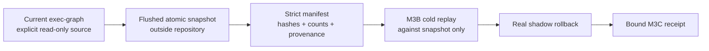

# M3C Preserved-State Rehearsal Design

Status: approved direction A by Yusif on 2026-07-30; written-spec review pending
Milestone: M3 Shadow Consolidation
Implementation authority: Codex SOL
Irreversible authority: Yusif

## Decision

M3C will create one durable local snapshot of the current exec-graph outside
the Git checkout, keep that snapshot as rollback evidence, and run the existing
M3B rehearsal only against the preserved copy.

The live source is an explicit read-only input. No resolver, writer, scheduler,
or process will ever point at the preserved or rehearsal directories.



## Goal

Prove that current authoritative exec-graph state can be captured without
changing its source, cold-replayed from an independent local copy, compared
strictly, rolled back, and independently reverified from durable artifacts.

## Non-goals and hard boundaries

M3C does not:

- change `ATLAS_STATE_ROOT`, `ATLAS_EXEC_GRAPH_DIR`, CWD, or any live resolver;
- stop, start, reconfigure, or redirect AtlasRunner;
- write to `state/exec-graph`, `state/evidence`, `.env`, Railway, or Telegram;
- ignore or untrack runtime files;
- move a repository, junction, worktree, or scheduler binding;
- use VSS, filesystem snapshots, admin privileges, network, or a provider;
- migrate goal budgets, evidence, leases, queues, or other state stores;
- delete the preserved artifact automatically;
- authorize M4 physical cutover.

The artifact contains private local task state. It must never be pasted into a
model prompt, uploaded, or sent to Claude, Perplexity, Gemini, or ChatGPT.
External review receives only this specification, code paths, hashes, counts,
and command receipts.

## Fixed paths for the first live rehearsal

All directory inputs are explicit absolute paths. `artifactName` is a strict
single-segment basename. APIs do not discover either from environment
variables.

- Source:
  `C:\Users\user\OneDrive\Documents\GitHub\ANUS\state\exec-graph`
- Preservation parent:
  `C:\Projects\VOLAURA\memory\atlas\preservation`
- Artifact name:
  `atlas-exec-graph-m3c-<UTC compact timestamp>-<8 hex chars>`
- Final artifact:
  `<preservation parent>\<artifact name>`

The timestamp contains no colon. The random suffix prevents accidental name
reuse. Existing destinations are never overwritten or reused.

## Artifact layout

```text
atlas-exec-graph-m3c-<id>/
├── exec-graph/
│   ├── ledger.jsonl
│   └── graph.json
├── preservation-manifest.json
└── rehearsal-receipt.json       # exists only after successful M3C rehearsal
```

Absence of `rehearsal-receipt.json` means M3C is incomplete or failed. A
preserved snapshot without a success receipt remains useful diagnostic input
but is never treated as a passed gate.

## Components and ownership

### 1. Preservation component

Create `src/atlas/preserved-state-rehearsal.ts` with a public function shaped
as follows:

```ts
preserveExecGraphSnapshot(options: {
  sourceDirectory: string;
  preservationParentDirectory: string;
  artifactName: string;
}): PreservedExecGraphManifest
```

The proof-producing API exposes no injectable clock, writer, child, hashing,
comparison, rename, cleanup, manifest, inspection, or receipt dependency.

The function reuses these verified M3A/M3B primitives:

- `inspectExecGraphDirectory`;
- `compareExecGraphDirectories`;
- `copyExecGraphDirectoryAtomic` using its default flushed writer.

It does not implement a second inspector, comparator, or copy algorithm.

### 2. Rehearsal component

The same module exposes:

```ts
rehearsePreservedExecGraph(options: {
  artifactDirectory: string;
  childTimeoutMs?: number;
}): PreservedStateRehearsalReceipt
```

This function loads and strictly validates the manifest, proves the preserved
files still match it, then calls `runShadowRehearsal()` with the preserved
`exec-graph` directory as source. It cannot replace the child script, writer,
comparator, rollback verifier, or receipt writer.

The work parent is always `dirname(artifactDirectory)`. The caller cannot
redirect recursive cleanup to another location.

### 3. Independent verifier

The same module exposes a read-only verifier:

```ts
verifyPreservedStateRehearsal(
  artifactDirectory: string,
): VerifiedPreservedStateRehearsal
```

It reads strict manifest and receipt bytes, verifies the receipt-bound manifest
SHA-256, reinspects preserved files, checks every bound hash/count/path/boolean,
and confirms the recorded rehearsal shadow and M3C work paths are absent. It
also proves the work path is the expected generated direct child beside the
artifact before using it as evidence. It never writes, repairs, normalizes, or
deletes anything.

### 4. Bounded CLI/script entry

Create one explicit-path script under `scripts/` for the real drill. It invokes
preserve, rehearse, then the independent verifier sequentially and prints only
artifact path, hashes, counts, status, and named blockers. It never prints
ledger rows or graph contents.

The script has no default source or destination. Missing absolute arguments
fail before any filesystem mutation.

## Preservation data flow

1. Resolve and validate the three caller paths.
2. Refuse a source/destination overlap, path traversal, separator in
   `artifactName`, non-absolute path, or existing final artifact.
3. Inspect source as observation `S0` using M3A strict rules.
4. Create only a uniquely named sibling staging directory under the approved
   preservation parent.
5. Copy source into `<staging>/exec-graph` using the M3B default writer. Both
   files use Node's durable flush option before the inner atomic rename.
6. Inspect source again as `S1`.
7. Run `compareExecGraphDirectories(source, preserved)`; its source inspection
   is observation `S2` and its candidate inspection is `P0`.
8. Require `S0`, `S1`, and `S2` to match on ledger SHA-256, snapshot SHA-256,
   semantic SHA-256, event count, goal count, and task count.
9. Require the M3A comparison to be accepted, including exact ledger bytes,
   semantic snapshot equality, and count equality.
10. Write and flush `preservation-manifest.json` inside staging.
11. Atomically rename the complete staging directory to the final artifact.
12. Return the validated manifest. Do not begin rehearsal inside this function.

This proves a stable observation window. It does not claim the live source can
never change after `S2`; it proves exactly which stable state was captured.

## Rehearsal data flow

1. Refuse a missing artifact, missing manifest, or existing success receipt.
2. Read raw manifest bytes, calculate their SHA-256, and validate a strict
   schema with unknown fields rejected.
3. Inspect `<artifact>/exec-graph` and require its hashes and counts to match the
   manifest before starting a child process.
4. Create one unique `.m3c-work-<uuid>` sibling under
   `dirname(artifactDirectory)`.
5. Run `runShadowRehearsal()` against the preserved directory with only
   `workDirectory` and optional timeout. The M3B module owns durable copy,
   fixed child identity, strict parity, real rollback, and bound receipt.
6. Reinspect the preserved directory and require it still matches the manifest.
7. Build the prospective M3C receipt from the validated manifest, manifest
   SHA-256, exact generated work path, M3B receipt, and final preserved-state
   inspection. Caller-supplied receipt data is forbidden.
8. Remove only the exact work directory created by this invocation and verify
   it is absent.
9. Only after that observation, write the success receipt via a flushed
   `.m3c-receipt-<uuid>` temporary sibling and atomic rename. Refuse overwrite
   and remove only that exact temporary file on failure.
10. Invoke `verifyPreservedStateRehearsal()` so the just-written receipt,
    manifest, preserved bytes, absent shadow, and absent work directory are all
    re-read from disk instead of trusted from in-memory objects.
11. Return only the independently verified M3C receipt.

This order is structural: cleanup failure makes the receipt-writing branch
unreachable. No receipt may claim an absent work directory before absence was
observed.

## Manifest contract

`preservation-manifest.json` is strict JSON with:

- `schemaVersion: 1`;
- `kind: "atlas.exec-graph-preservation"`;
- `createdAt` in ISO-8601 UTC;
- resolved `sourceDirectory`, `artifactDirectory`, and `preservedDirectory`;
- `sourceBefore`, `sourceAfterCopy`, `sourceDuringComparison`, and `preserved`;
- for each inspection: three SHA-256 values and event/goal/task counts;
- comparison booleans for ledger bytes, semantic snapshot, counts, and
  `accepted: true`;
- `sourceStable: true` and `preservationAccepted: true`.

The manifest contains no ledger rows, task titles, evidence content, secrets,
environment values, cookies, or provider identifiers.

## Receipt contract

`rehearsal-receipt.json` is strict JSON with:

- `schemaVersion: 1`;
- `kind: "atlas.m3c-preserved-state-rehearsal"`;
- `completedAt` in ISO-8601 UTC;
- resolved artifact and preserved-directory paths;
- resolved generated `workDirectory` and `workDirectoryAbsent: true`;
- SHA-256 of the exact manifest bytes reviewed;
- preserved ledger, snapshot, and semantic SHA-256 values;
- event, goal, and task counts;
- `preservationAccepted: true`;
- `coldReplayAccepted: true`;
- `rollbackVerified: true`;
- `preservedStateUnchanged: true`;
- the bound M3B rehearsal receipt.

A receipt is valid only when its manifest SHA and preserved-state hashes still
match current artifact bytes. Narrative success without those checks is not a
receipt.

## Failure model

Fail closed with stable named codes. At minimum:

- `path_invalid` — relative, overlapping, escaped, or malformed path;
- `artifact_exists` — final artifact already exists;
- `source_mutated` — `S0`, `S1`, or `S2` differ;
- `preservation_mismatch` — M3A comparison rejects the copy;
- `manifest_invalid` — missing, malformed, schema-invalid, or unknown fields;
- `manifest_tampered` — manifest SHA does not match a bound receipt;
- `preserved_state_tampered` — current preserved files differ from manifest;
- `receipt_invalid` — malformed, schema-invalid, or internally inconsistent
  success receipt;
- `receipt_exists` — success receipt already exists;
- `rehearsal_failed` — wrapped named M3B failure without a success receipt;
- `cleanup_failed` — exact staging/work cleanup could not be observed.

Preservation-phase failure removes only the exact staging directory created by
that call and leaves no final artifact. Rehearsal-phase failure keeps the
already valid preserved artifact, writes no success receipt, and attempts to
remove its exact work directory. If absence is observed, it reports the
underlying named blocker. If cleanup cannot be observed, it reports
`cleanup_failed` and still writes no receipt.

Before any recursive cleanup, code verifies the resolved target is a direct
child of the intended parent and has the generated `.m3c-staging-` or
`.m3c-work-` prefix. No glob, environment expansion, repository root, home
directory, or unresolved variable may be a cleanup target. Receipt-write
failure may remove only its exact generated `.m3c-receipt-` temporary file,
which must be a direct child of the artifact.

## Durability boundary

M3C's storage claim is exact: copied data files and manifest are flushed before
their enclosing staging-directory rename; the receipt is flushed before its
file rename; and no partially assembled final artifact is made visible. The
independent verifier rereads final bytes instead of trusting objects retained
in memory. M3C does not claim proof against whole-volume loss, hardware
write-cache failure, or a power cut during directory-metadata update; those
require a separate reboot or storage-fault drill.

## Trust boundary

M3C detects accidental corruption and any post-receipt change to manifest,
receipt, or preserved files. Before the first receipt exists, a hostile process
with permission to replace the entire artifact and coherently rewrite its
manifest is outside this local same-user trust model. Proving against that
threat would require a signed manifest or an external immutable hash anchor and
is not claimed here.

## Test contract

All automated tests use generated fixtures and temporary directories. They do
not read the real `state/exec-graph` or preservation root.

Required RED-to-GREEN cases:

1. valid snapshot produces an atomically visible artifact and strict manifest;
2. both data files and manifest are durably flushed before the enclosing
   directory rename, and the receipt is flushed before its file rename;
3. source mutation during the copy produces `source_mutated`, no final
   artifact, and no staging residue;
4. divergent copied bytes produce `preservation_mismatch` and no final artifact;
5. existing artifact is refused and remains byte-for-byte unchanged;
6. relative, overlapping, traversal, and separator-bearing names are refused
   before creation;
7. missing/empty/malformed source preserves existing M3A error codes;
8. manifest unknown fields, malformed JSON, or path mismatch fail before child
   process invocation;
9. post-preservation ledger or snapshot tampering yields
   `preserved_state_tampered` and no success receipt;
10. happy rehearsal cold-replays only the preserved directory, removes the
    shadow/work directory, keeps preserved bytes unchanged, and writes one
    bound receipt;
11. a second success-receipt attempt is refused without overwrite;
12. forged writer, child script, manifest object, inspection object, or receipt
    payload cannot enter the proof-producing public API;
13. changing CWD or setting `ATLAS_EXEC_GRAPH_DIR` to another fixture does not
    change explicit-path behavior;
14. independent verification passes on an untouched completed artifact;
15. post-receipt manifest, receipt, or preserved-file tampering makes the
    independent verifier fail closed without writing;
16. work-directory cleanup failure produces `cleanup_failed`, leaves no success
    receipt, and never invokes the receipt writer;
17. receipt-write failure leaves neither a final receipt nor a receipt-temp
    residue and never deletes any other artifact file;
18. network is disabled in the integration test and no network call occurs.

Failure-path injection uses hoisted test-module mocks around imported filesystem
and M3A/M3B primitives. No fault dependency is added to any public production
API. A production-shape test rejects extra proof inputs and exercises the
unmocked path end to end.

The existing M3A/M3B/state-root/exec-graph/cost-router regression matrix must
remain green. `npx tsc --noEmit` and diff checks must exit 0.

## First real rehearsal gate

After fixture tests and an independent code review pass, Codex runs the real
rehearsal once with the fixed paths above.

Preflight is read-only:

- confirm exact branch and commit;
- confirm the five unrelated dirty paths remain unchanged;
- confirm `AtlasRunner` is not in `Running` state; if it is running, stop with
  a blocker and do not stop it automatically;
- inspect current source and compare hashes/counts with the recorded baseline;
- confirm final artifact path does not exist.

Acceptance evidence:

- command and exit code;
- final artifact path and exact file list;
- manifest SHA-256;
- source and preserved ledger/snapshot/semantic SHA-256 values;
- event/goal/task counts;
- accepted M3A comparison;
- cold-child result;
- observed shadow rollback and absent work directory;
- preserved bytes unchanged after rehearsal;
- success receipt validates against manifest and preserved files;
- source hashes and Git status unchanged from preflight;
- no resolver, process, scheduler, network, untrack, move, push, or deployment
  action occurred.

The artifact is retained until physical consolidation is completed and Yusif
later authorizes archive or deletion. M3C itself never deletes it.

## Role and cost allocation

- **Codex SOL:** architecture, proof-boundary implementation, local command
  verification, Git scope, and final disposition.
- **LUNA/Sonnet:** at most one bounded mechanical lane after the implementation
  plan, limited to fixture/test or CLI wiring. No proof architecture or closure
  authority.
- **Opus/Fable:** one read-only adversarial review of this specification and
  later diff, at most 10 direct Read/Search calls, no Agent, shell, edits,
  polling, or completion claim.
- **Perplexity/Gemini/ChatGPT research:** not used. M3C needs local deterministic
  evidence, not web research.
- **Yusif:** no further action until a physical cutover, deletion, move,
  scheduler change, or other irreversible gate is proposed.

## External review contract

Opus/Fable reviews this document read-only. Maximum 10 direct `Read`/`Search`
calls. No Agent, Bash, Edit, Write, polling, local command claims, or completion
authority. Stop immediately on the first seat/policy/capability block.

Review only these risks: proof authority, caller-controlled seams, path and
recursive-cleanup safety, TOCTOU window, manifest/receipt binding, receipt
ordering, tamper boundary, and whether acceptance tests can falsify every
success claim.

Return exactly:

```text
VERDICT: ACCEPT | ACCEPT_WITH_CHANGES | REJECT
CRITICAL_GAPS:
REQUIRED_CHANGES:
ACCEPTANCE_TESTS:
UNVERIFIED:
NEXT:
```

## Deferred after M3C

- deterministic coverage for the existing M3B `replay_spawn_failed` branch;
- all-store migration beyond exec-graph;
- state-machine sequence-legality strengthening;
- conditional ignore/untrack of generated exec-graph files;
- M3D rollback/cutover packet;
- M4 physical consolidation and scheduler/Railway path changes.
