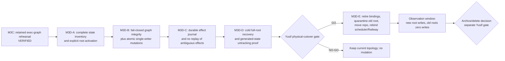

# M3D Cutover Readiness and Rollback Packet Design

**Status:** design-only packet; physical cutover is **NO-GO**.

**Goal:** make Atlas code relocation and runtime-state cutover reversible,
observable, and incapable of silently splitting authority between the OneDrive
checkout, the legacy `C:\Projects\ATLAS` repository, and a node-local state
root.

## Scope boundary

This packet defines gates and rollback anchors. It does not stop a process,
remove a worktree, alter a junction, copy a secret, change Git tracking, move a
directory, edit Task Scheduler, relink Railway, deploy, push, merge, or activate
a live resolver.

Final intended topology:

- code: `C:\Projects\ATLAS` (the existing `atlas-cli` repository moved out of
  OneDrive; no rewrite);
- local runtime state: explicit `ATLAS_STATE_ROOT` outside the code checkout,
  with `C:\Users\user\.atlas\state` as the local target;
- Railway runtime state: explicit `ATLAS_STATE_ROOT` on the mounted persistent
  volume;
- one Railway Telegram/control poller and one non-polling local executor;
- no runtime authority in a Git-tracked file or path selected from process CWD.

## Current verified truth

| Surface | Current evidence | Consequence |
|---|---|---|
| M3C preserved graph | retained artifact `atlas-exec-graph-m3c-20260730T145320Z-b16264df`; 96 events, 4 goals, 10 tasks; manifest SHA-256 `432984c34c373c13fce53ef21828aa7e88231180c343d03a21b5619a3b2b3d25` | exec-graph copy/replay mechanism is proven, not activated |
| ANUS checkout | `codex/atlas-cost-router-design@eb9526c`; five unrelated dirty rows | preserve exactly; do not treat as clean cutover input |
| Target root | separate `ganbaroff/atlas.git` repo at `experiment/scrapegraphai-poc@0e6c16e`; 45 uncommitted paths when untracked files are expanded | target is occupied; quarantine, never overwrite |
| Nested worktrees | six under `C:\Projects\ATLAS\worktrees`; `atlas-m4-memory` has eight staged additions, other five are clean | retire before moving either repository |
| Junctions | `apps\cli` -> ANUS, `memory` -> VOLAURA Atlas memory, `shared-bus` -> VOLAURA shared bus | snapshot targets; never recursively clean through them |
| Scheduler | `AtlasRunner` Ready; direct `node.exe dist\cli.js runner start --interval 20`; OneDrive ANUS working directory | must be rebound to verified wrapper and new root in same gated cutover |
| Railway CLI | local config contains exact ANUS project-path binding | must be rebound and read back; local config is not deployment proof |
| Secrets file | `.env` exists only in ANUS root; contents were not read | path handling is a CEO-controlled secret operation |
| Git runtime state | `state/exec-graph/graph.json` and `ledger.jsonl` are tracked; `state/evidence/` is untracked and not ignored | untracking remains proof-gated; no state may be lost |

Existing legacy-target preservation remains an input, not permission to delete:

- experiment bundle SHA-256
  `2061409F79D45AA85F39AED20816A5FA169DF7D834F65B75C14C994D844BEFD4`;
- 38-file ZIP SHA-256
  `D2147E7A8349E8351C88F9DB4CD193029903E78A7AA2780E23C39891C43D968C`;
- tracked-data patch SHA-256
  `86EA164CD19B5935B6D1D0B29F19A0DE9F6EA9105110262CD295858B31576B44`;
- manifest SHA-256
  `4E21C27B4AF0E97F99EFBBE0C8B748FC2ADCB15CC9895903447085EE25DBB5EE`;
- dirty M4 staged-index patch SHA-256
  `BBBC6B4D4EF3851F5A2AD2B7A50B84DC0A0D8613919AC07B1363DF646D5F9816`
  and local preservation commit
  `3d29594db8a2a3eee0cc21c980619cd3a159a513`.

## Roadmap and authority

Codex owns implementation and command verification. One bounded LUNA lane may
perform disjoint mechanical work. Fable/Opus is reserved for one compact
rollback-critical review after the packet is locally green, not for waiting,
shell execution, or self-certification.

## M3D-A — state-root activation

The `state-root.ts` registry now covers 23 stores. Cost Router uses the direct
resolver; A2 slices 1-4 route exec-graph, evidence, goal budgets, swarm runs,
intake drafts, operator state/runs, and task results through a compatibility
bridge.
Explicit test/legacy roots remain valid before activation but cannot bypass a
required activated root. File-level operator overrides must be strict
junction-aware children of `operator-runs`, and registered default store
directories may not junction outside the root. Task-results activation is
validated before subprocess execution. Remaining checkout-bound writers include
learning state.
Home-directory writers also remain split across lease, queue-auth nonce ledger,
provider health, spend, notifications, pause/control, breadcrumbs, and alert
state.

Before migration, classify every filesystem writer into exactly one category:

1. **authoritative** — loss or split changes decisions, task state, budgets,
   control, idempotency, evidence, or receipts; must live under the root;
2. **operational** — required for liveness/audit but rebuildable; either live
   under a named root subdirectory or carry an explicit exclusion;
3. **ephemeral** — disposable cache/temp output; must never be treated as
   recovery input;
4. **configuration/content** — policy, code, secrets, or VOLAURA memory; not
   runtime state and not silently migrated.

Activation contract:

- production entry points require a stable absolute `ATLAS_STATE_ROOT`;
- `ATLAS_STATE_ROOT` alone is staging, not activation: migrating call sites
  retain their exact legacy env/default until `ATLAS_STATE_ROOT_REQUIRED` is
  enabled;
- an activation manifest under that root binds schema version, node role,
  classified store list, source receipt hashes, and activation time;
- before live activation, expected node role comes from outside the manifest
  and every allowlisted source-receipt hash is verified against its artifact;
  self-asserted manifest fields are not proof;
- after activation, missing root, missing/invalid manifest, a classified store
  outside the root, or a legacy override escaping the root is a named refusal;
- test fixtures use explicit temporary legacy overrides or manifest-bound
  temporary roots; no test writes the live root;
- no call site derives classified state from CWD, module location, the code
  checkout, or an implicit home fallback after activation.

Acceptance:

- source-level inventory test covers every filesystem write call in classified
  modules;
- changing CWD and code-root location does not change any classified path;
- production activation with an omitted root refuses before mutation;
- a staged root without required activation reroutes zero migrating stores;
- a legacy override outside the activated root refuses;
- wrong node role or an unverifiable source receipt refuses before mutation;
- both local and Railway target manifests can be validated without reading
  secret values.

## M3D-B — mutation authority, integrity, and concurrency

Current gaps are concrete:

- `reassignOwner`, `addEvidence`, `moveTaskAsVerifier`, and
  `reassignOwnerAsVerifier` do not call `assertWritable`;
- `appendEvent` itself has no read-only guard;
- malformed ledger rows are skipped for availability, so a damaged ledger can
  still be used as the base for a new write;
- `persistEvent` logs append failure and returns, while callers can still
  report the mutation as successful;
- mutations read, validate, and append outside one exclusive transaction;
- instance lease acquisition is read-then-replace, not exclusive creation.

Required design:

- diagnostic reads remain available and loud on malformed state;
- every mutation enters one central transaction that enforces writable mode,
  holds an exclusive filesystem lock, strictly validates the complete ledger,
  re-reads current state under the lock, applies one legal event, durably
  flushes it, then refreshes the disposable snapshot;
- write failure throws a typed error; no caller receives a success-shaped
  result for an unpersisted event;
- transition requests bind to the state/revision observed for validation;
  a second simultaneous request receives explicit `ExecGraphConflictError`;
- verifier privilege changes which transitions are legal, never bypasses
  writable, integrity, lock, or persistence gates;
- instance writer lease acquisition uses an exclusive primitive and lives
  under the activated root.

Acceptance:

- every public and privileged mutator refuses in read-only mode;
- malformed/truncated ledger permits diagnosis but refuses mutation and task
  execution;
- injected append/fsync failure produces no success return and no snapshot that
  claims the missing event;
- two simultaneous transitions from one revision yield one persisted event and
  one explicit conflict;
- two simultaneous writer starts yield one writer and one read-only process.

## M3D-C — effect durability

File locking cannot make an external browser click, process execution, or
provider call transactional with local state. Exact-once is therefore defined
as **no automatic duplicate**, not as pretending an unknowable outcome is
known.

Each effect gets a stable operation ID and a durable journal under the state
root:

`prepared -> started -> succeeded|failed|outcome_unknown -> reconciled`

Rules:

- flush `started` before invoking the effect;
- use the same operation ID as provider idempotency key where supported;
- flush provider/process receipt before closing graph/queue state;
- on restart, `started` without a terminal receipt is `outcome_unknown`;
- never automatically replay `outcome_unknown`; block/escalate for explicit
  reconciliation;
- a queue stale-claim sweep consults this journal before making a command
  executable again;
- safe, explicitly read-only observations may use a separately documented
  replay policy; mutations may not inherit it.

Acceptance:

- crash before effect: one later execution is allowed;
- crash after `started` and before receipt: zero automatic re-executions and a
  named `outcome_unknown` blocker;
- crash after receipt and before graph transition: resume consumes the existing
  receipt and does not repeat the effect;
- identical command/task resume uses the same operation ID;
- queue and goal-runner paths share this rule rather than implementing two
  incompatible ledgers.

## M3D-D — full-root recovery and Git-state separation

Create a retained, hashed copy of every authoritative store into a fresh root.
Launch a cold child process with only the candidate root and explicit code path.
For each store, run its native integrity check; for exec-graph, reuse the strict
M3A comparator. Silence, missing data, empty authoritative state, unreadable
records, unknown stores, or partial receipts are failures.

Only after cold recovery passes:

- add intentional ignore rules for generated runtime data;
- remove only `state/exec-graph/graph.json` and `ledger.jsonl` from Git tracking
  under Yusif's existing proof-gated approval;
- keep `.gitkeep` unless the legacy directory itself is separately retired;
- prove current root remains authoritative and `git status state/` is clean by
  design, not because evidence was discarded.

Acceptance:

- fresh process reconstructs exact authoritative state without reading old
  checkout paths;
- source and candidate manifests match all store-specific invariants;
- rollback to the source root is executed once and verified;
- generated-state tracking change contains no content loss and is independently
  diff-reviewed.

## M3D-E — future physical cutover packet

This section is executable only after M3D-A through M3D-D are green and Yusif
issues a specific physical-cutover GO.

Pre-cutover anchors, all hashed and read back:

- ANUS full Git bundle plus patch/ZIP for every uncommitted and ignored item in
  the approved allowlist;
- legacy ATLAS full Git bundle plus current working-data patch/ZIP;
- dirty M4 staged-index patch and preservation ref;
- Task Scheduler XML export;
- redacted Railway path-binding record;
- junction target manifest;
- `.env` presence/owner/ACL receipt without content;
- exact old/new directory existence and free-space receipt.

Strict order:

1. stop and prove stopped: runner, scheduled trigger, and any writer lease;
2. re-verify all anchors and state-root cold recovery;
3. retire clean nested worktrees; retire dirty M4 only after its patch/ref
   reconstructs in a disposable location;
4. snapshot then detach the three junctions without traversing their targets;
5. rename the occupied legacy repository to a timestamped quarantine sibling;
   never delete it;
6. move the existing ANUS repository to `C:\Projects\ATLAS`;
7. validate Git object/ref/worktree status before any binding change;
8. bind explicit state root and activation manifest;
9. change `AtlasRunner` to the verified `scripts\start-runner.cmd` wrapper and
   new working directory; run exactly one live restart proof;
10. rebind Railway from the new root and read back the exact project/service;
11. verify one Telegram poller, one local executor, graph/root parity, clean
    intentional Git state, and zero writes at old roots;
12. enter an observation window. Archive/delete remains a separate decision.

Rollback trigger: any failed invariant, ambiguous effect, unexpected writer,
missing secret/config dependency, scheduler failure, Railway mismatch, graph
drift, or write at an old root.

Rollback order:

1. stop the new runner and disable its trigger;
2. restore prior scheduler XML and prior Railway path binding;
3. restore the prior explicit state-root binding; never merge divergent roots;
4. move the new code root back to its recorded source location;
5. rename the quarantined legacy root back to `C:\Projects\ATLAS`;
6. restore worktree/junction topology only from the recorded manifest when
   required;
7. start at most one prior writer and verify state hashes;
8. retain both cutover and rollback evidence. Delete nothing.

## GO / NO-GO rule

Physical cutover is GO only when every M3D-A through M3D-D acceptance test has
current command evidence, rollback anchors have been reconstructed at least
once in disposable locations, and Yusif approves the exact physical operation.
Any missing evidence is NO-GO. Time pressure never weakens this rule.
